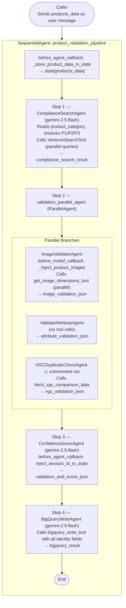

# Technical Design Document
## Product Validation Pipeline — POC Image Features

Date: April 6, 2026  
Framework: Google Agent Development Kit (ADK)

---

## Table of Contents

1. Project Overview  
2. System Architecture  
3. Active Pipeline Execution Flow  
4. Agent Deep-Dive  
   - 4.1 Compliance Search Agent — ComplianceSearchAgent  
   - 4.2 Image Validator Agent — ImageValidatorAgent  
   - 4.3 Attribute Validation Agent — ValidateAttributeAgent  
   - 4.4 Confidence Score Agent — ConfidenceScoreAgent  
   - 4.5 BigQuery Write Agent — BigQueryWriteAgent  
   - 4.6 VGC Duplicate Check Agent — VGCDuplicateCheckAgent  
5. Tools Reference  
6. Session State Lifecycle and Data Contracts  
7. Data Model(s)  
8. External Services & Environment Configuration  
9. Python Dependencies  
10. Data Flow Diagram  
11. Known Gaps and Next Steps

---

## 1. Project Overview

This project implements a multi-agent product validation pipeline on Google’s Agent Development Kit (ADK). The pipeline:
- Accepts raw product data posted as the user message and stores it in session state automatically via a root `before_agent_callback`
- Retrieves compliance rules (image, attribute, PR/Legal, brand, vendor, category hierarchy P1/P2/P3) via Vertex AI Search
- Validates product images visually using Gemini multimodal vision (inline `Part.from_uri` injection) and a PIL-based dimensions tool
- Validates product attributes including PR/Legal requirements, spelling correctness, category hierarchy, variants, brand consistency, and vendor agreements
- Produces a per-product tiered decision (Accepted / Temporary Rejection / Permanent Rejection) mapped to an Approve/Reject enum alongside a confidence score (0–100)
- Captures the ADK session ID in state and includes it in all output and BigQuery records
- Writes a rich validation record (score, decision, all identity fields, session ID) to BigQuery
- Implements VGC (Variant Group Code) duplicate detection against existing BigQuery data (available, currently optional)

The pipeline is orchestrated by a root `SequentialAgent`. A `ParallelAgent` step runs image and attribute validation concurrently. A VGC duplicate-check agent is fully implemented and can be enabled in the parallel step alongside a corresponding update to the confidence score prompt.

---

## 2. System Architecture

### Agent Hierarchy (as implemented)

```
product_validation_pipeline          (SequentialAgent — root)
├── ComplianceSearchAgent            (LlmAgent — Step 1)
├── validation_parallel_agent        (ParallelAgent — Step 2)
│   ├── ImageValidatorAgent          (LlmAgent — parallel branch A)
│   └── ValidateAttributeAgent       (LlmAgent — parallel branch B)
│   # └── VGCDuplicateCheckAgent     (LlmAgent — parallel branch C, currently commented out)
├── ConfidenceScoreAgent             (LlmAgent — Step 3)
└── BigQueryWriteAgent               (LlmAgent — Step 4)
```

- File: `root_agent/agent.py`  
- The root agent's `before_agent_callback` (`_store_product_data_in_state`) reads the latest user message text and writes it to `state["products_data"]` before any sub-agent runs.  
- The parallel agent runs image and attribute validation concurrently, writing their outputs to independent session keys to avoid conflicts.

---

## 3. Active Pipeline Execution Flow

Inputs: Caller posts `products_data` as a JSON string (or list) in the user message. The root agent's `before_agent_callback` automatically stores it to session state under the key `products_data`.

Sequence:

1) **ComplianceSearchAgent** (Step 1)
   - Reads: `products_data` (for `product_category` field to resolve P1/P2/P3)
   - Calls: `VertexAiSearchTool` in parallel with multiple domain-specific queries
   - Writes: `compliance_search_result`

2) **validation_parallel_agent** (Step 2)
   - Branch A — **ImageValidatorAgent**
     - Reads: `products_data`, `compliance_search_result`
     - Calls: `get_image_dimensions_tool` (FunctionTool)
     - Injects images as `Part.from_uri` via `before_model_callback`
     - Writes: `image_validation_json`
   - Branch B — **ValidateAttributeAgent**
     - Reads: `products_data`, `compliance_search_result`
     - Writes: `attribute_validation_json`
   - *(Branch C — VGCDuplicateCheckAgent, currently commented out)*
     - *Reads: `products_data`*
     - *Calls: `vgc_fetch_tool` (FunctionTool)*
     - *Writes: `vgc_validation_json`*

3) **ConfidenceScoreAgent** (Step 3)
   - Reads: `image_validation_json`, `attribute_validation_json`, `products_data`
   - `before_agent_callback` (`inject_session_id_to_state`) captures the ADK session ID into `state["session_id"]`
   - Writes: `validation_and_score_json`

4) **BigQueryWriteAgent** (Step 4)
   - Reads: `validation_and_score_json`, `products_data`
   - Calls: `bigquery_write_tool` (FunctionTool)
   - Writes: `bigquery_result`

Ordering guarantees:
- Steps 1 → 2 → 3 → 4 run in sequence.
- Inside Step 2, agents run in parallel.

---

## 4. Agent Deep-Dive

### 4.1 Compliance Search Agent — ComplianceSearchAgent

- Type: LlmAgent  
- Model: `gemini-2.5-flash`  
- File: `root_agent/sub_agents/compliance_search_agent.py`  
- Output key: `compliance_search_result`  
- Tool(s): `VertexAiSearchTool`

Configuration:
- Loads environment variables with `python-dotenv`.
- `PROJECT_ID` from env var `GOOGLE_CLOUD_PROJECT`.
- `DATASTORE_ID` is built as a fully qualified Vertex AI Search datastore:
  `projects/{GOOGLE_CLOUD_PROJECT}/locations/us/collections/default_collection/dataStores/validation-documents-stg_1774252852913_gcs_store`

Behavior:
- Reads `product_category` from `products_data` and uses it to resolve the full category hierarchy: **P1** (Primary Product Type), **P2** (Product Type), **P3** (Product Sub-type).
- Issues all of the following search queries in a **single parallel invocation**:
  - Category hierarchy resolution (P1/P2/P3) using the actual `product_category` value
  - Category validation rules for title/description vs P1/P2/P3 hierarchy
  - Mandatory image requirements (size, quality, size charts, text overlays, backgrounds, aspect ratios)
  - Required attributes per product type (`prop_65`, `choking_hazard`, `containsPFAS`, etc.)
  - Attribute rules for categories, variants, brands, vendor agreements
  - Ready to Wear and Lifestyle product image rules
  - Baby Gear / Team / Beauty vendor rejection criteria
  - PR and Legal requirements (warranty language, prohibited marketing/legal claims)
- For every document returned, captures the exact source URI and populates `references` in the output.
- Category validation rules include the resolved P1/P2/P3 inline in the `requirement` text so downstream validators can check semantic consistency.
- Returns ONLY JSON:

```json
{
  "compliance_rules": [
    {
      "category": "<Image Issues | Category Validation | Variants | Vendor Agreements | Brand Consistency>",
      "rule_type": "<type of rule, e.g., dimensions, background, variants>",
      "requirement": "<specific requirement>",
      "applies_to": "<all products | specific category | Ready to Wear | Lifestyle>",
      "references": "<exact source URI(s) from the search tool response>"
    }
  ],
  "summary": "<brief summary>"
}
```

Notes:
- Agent must not generalise category-specific rules to all products.

---

### 4.2 Image Validator Agent — ImageValidatorAgent

- Type: LlmAgent  
- Model: `gemini-2.5-flash`  
- File: `root_agent/sub_agents/validate_image_agent.py`  
- Output key: `image_validation_json`  
- Tool(s): `get_image_dimensions_tool` (FunctionTool)

`before_model_callback` — `_inject_product_images`:
- Reads all product image URLs from `state["products_data"]`.
- Injects each image as `Part.from_uri` into the Gemini request along with a descriptive text label per image.
- MIME type is inferred from URL extension (`.png` → `image/png`, `.webp` → `image/webp`, `.gif` → `image/gif`, default → `image/jpeg`).
- **Skips re-injection on tool-response turns** (detects `function_response` parts in the request to avoid duplicate image injection on subsequent LLM calls).
- Always uses `data.main_image.source` as the primary URL, falling back to `original_url`; same behaviour for `data.alt_image_*` keys.

Core behavior:
- Step 1: Uses compliance rules as-is from `compliance_search_result` — does NOT call any search tool.
- Step 2: Calls `get_image_dimensions_tool` in **parallel** for all image URLs simultaneously (single parallel invocation).
- Step 3: Visually inspects each injected image against all applicable compliance rules:
  - Image size, resolution, and clarity
  - Size chart inclusion for apparel
  - Item clearly shown and matching the title
  - No text overlays or watermarks
  - Background rules: Ready to Wear → white background (aspect ratio deviation allowed); Lifestyle → non-white background allowed but must be 1:1
  - Brand consistency in images (no conflicting brands)
  - Variant colour match in image
  - PR/Legal compliance for any text visible in images (warranty language, prohibited claims)
  - **Spelling correctness** for any visible text in images (product titles, labels, marketing copy shown in the image)

Output:
```json
{
  "results": [
    {
      "product_id": "...",
      "image_url": "...",
      "image_type": "main",
      "width": 1920,
      "height": 1080,
      "format": "JPEG",
      "compliant": true,
      "compliance_score": 92,
      "rule_results": [
        {"rule": "...", "passed": true, "observation": "..."}
      ],
      "issues": [],
      "details": "..."
    }
  ],
  "compliance_rules_applied": ["..."]
}
```

---

### 4.3 Attribute Validation Agent — ValidateAttributeAgent

- Type: LlmAgent  
- Model: gemini-2.5-flash  
- File: root_agent/sub_agents/validate_attribute_agent.py  
- Output key: attribute_validation_json  
- Tool(s): none (relies on `compliance_search_result`)

Core behavior:
- Consumes `products_data` and `compliance_search_result`.
- Validates textual and structural attributes (PR/legal wording constraints, required fields, brand consistency in text, variants logic, spelling correctness in customer-facing text).
- Does not perform image analysis (that’s ImageValidatorAgent’s scope).

Output:
```
{
  "mirakl_product_id": "<id>",
  "product_sku": "<sku>",
  "invalid_attributes": [
    {"attribute": "<name>", "issue": "<description>"}
  ],
  "rule_results": [
    {"rule": "...", "passed": true, "observation": "..."}
  ],
  "category_validation": {"p1_p2_p3_correct": true, "issues": []},
  "variant_validation": {"unique_combinations": true, "issues": []},
  "brand_validation": {"consistent": true, "issues": []},
  "vendor_rejection": {"rejected": false, "reason": ""}
}
```

---

### 4.4 Confidence Score Agent — ConfidenceScoreAgent

- Type: LlmAgent  
- Model: `gemini-2.5-flash`  
- File: `root_agent/sub_agents/confidence_score_agent.py`  
- Output key: `validation_and_score_json`  
- Tool(s): none  
- `before_agent_callback`: `inject_session_id_to_state` — reads `callback_context.session.id` and writes it to `state["session_id"]` before the agent prompt runs.

Core behavior:

**Step 1 — Quality Scoring**  
Uses judgment (not a fixed formula) to assign a `confidence_score` (0–100) by combining attribute and image findings holistically. Considers severity and volume of issues across both reports.

**Validation Decision — Three-Tier Logic:**

| Decision | Enum Output | Criteria |
|---|---|---|
| Accepted | `Approve` | Passes all checks or only negligible minor issues. Ready to go live. |
| Temporary Rejection | `Reject` | Correctable errors seller can fix and resubmit under the same Product ID. Examples: spelling mistakes, missing minor attributes, incorrect category, minor image issues, competitor brand mentions. Product moves to "pending verification" on resubmission. |
| Permanent Rejection | `Reject` | Uncorrectable violations requiring product deletion and re-upload. Examples: PR/legally sensitive terms (e.g. "bamboo" on non-bamboo material), inappropriate image content, counterfeit branding, fraudulent listing, structural catalog errors. |

**Step 2 — Identity Field Extraction from `products_data`:**
- `variant_group_code` → `data.style_number`
- `brand` → `data.brand`
- `title` → `data.title`
- `description` → `data.meta_description`
- `size` → `data.nrf_size`
- `colour` → `data.display_color`
- `seller` → `sources[0].provider_code`

Strict enum constraints (must match exactly, case-sensitive):
- `validation_decision`: `Approve` | `Reject`
- `status`: `validated`

Output:
```json
{
  "mirakl_product_id": "<id>",
  "status": "validated",
  "confidence_score": 85,
  "validation_decision": "Approve",
  "ai_comment": "<point-by-point reasoning covering attribute issues, image issues, and overall assessment>",
  "session_id": "<adk_session_id>"
}
```

---

### 4.5 BigQuery Write Agent — BigQueryWriteAgent

- Type: LlmAgent  
- Model: `gemini-2.5-flash`  
- File: `root_agent/sub_agents/bigquery_write_agent.py`  
- Output key: `bigquery_result`  
- Tool(s): `bigquery_write_tool` (FunctionTool)

Behavior:
- Reads both `validation_and_score_json` and `products_data`.
- Matches the product in `products_data` to the product in `validation_and_score_json` using `mirakl_product_id`.
- Calls `write_to_bigquery` with a `confidence_score_json` dict containing **all** of the following fields:

| Field | Source |
|---|---|
| `mirakl_product_id` | `validation_and_score_json` |
| `status` | always `"validated"` |
| `confidence_score` | `validation_and_score_json` |
| `validation_decision` | `validation_and_score_json` |
| `ai_comment` | `validation_and_score_json` |
| `variant_group_code` | `products_data[].data.style_number` |
| `brand` | `products_data[].data.brand` |
| `title` | `products_data[].data.title` |
| `description` | `products_data[].data.meta_description` |
| `size` | `products_data[].data.nrf_size` |
| `colour` | `products_data[].data.display_color` |
| `seller` | `products_data[].sources[0].provider_code` |

- Returns the tool's response as-is.

---

### 4.6 VGC Duplicate Check Agent — VGCDuplicateCheckAgent

- Type: LlmAgent  
- Model: `gemini-2.5-flash`  
- File: `root_agent/sub_agents/validate_vgc_agent.py`  
- Output key: `vgc_validation_json`  
- Tool(s): `vgc_fetch_tool` (FunctionTool)  
- **Status: Fully implemented. Currently commented out in `validation_parallel_agent`. Re-enabling requires uncommenting `validate_vgc_agent` in the parallel agent and updating the ConfidenceScoreAgent system prompt to consume `vgc_validation_json`.**

Core behavior:
- Reports VGC duplicate and colour conflict findings ONLY — does NOT make accept/reject decisions.
- Step 1: Extracts `variant_group_code` (`data.style_number`), `brand`, `title`, `size` (`data.nrf_size`), `colour` (`data.display_color`), and `seller` (`sources[0].provider_code`) from `products_data`.
- Step 2: Calls `fetch_vgc_comparison_data` with `variant_group_code`, `brand`, `title`, and `seller`.
- Step 3: Analyses two result sets:
  - **Cross-VGC matches** — rows from the same seller sharing identical brand + title under a *different* VGC code (possible duplicate submission with a different style number).
  - **Intra-VGC variants** — all existing rows under the same VGC group. Detects duplicate size+colour combinations (colour comparison is semantic: "Grey" == "Gray"; size is strict). Also flags inconsistencies in brand/title across variants in the VGC group.

Output:
```json
{
  "mirakl_product_id": "<id>",
  "cross_vgc_check": {
    "matches_found": 0,
    "matching_products": [],
    "observation": "No cross-VGC duplicates found for this seller + brand + title"
  },
  "intra_vgc_check": {
    "total_variants_in_group": 3,
    "existing_combinations": [{"mirakl_product_id": "...", "size": "M", "colour": "Red"}],
    "duplicate_found": false,
    "duplicate_products": [],
    "observation": "..."
  }
}
```

### 5.1 get_image_dimensions_tool
- Type: FunctionTool (wraps Python function)  
- File: `root_agent/tools/tools.py`  
- Function signature: `get_image_dimensions(url: str) -> Dict[str, Any]`  
- Behavior:
  - `requests.get(url, timeout=10)` → `PIL.Image.open(BytesIO(...))`
  - Returns on success: `{ url, width, height, format }`
  - Returns on failure: `{ url, error }`

### 5.2 bigquery_write_tool
- Type: FunctionTool (wraps Python function)  
- File: `root_agent/tools/bigquery_tool.py`  
- Function signature: `write_to_bigquery(confidence_score_json: dict) -> dict[str, Any]`  
- Environment:
  - `GOOGLE_CLOUD_PROJECT` (required)
  - `BQ_DATASET` (default: `product_validation`)
  - `BQ_TABLE` (default: `validation_results`)
- Behavior:
  - Validates input against the `ConfidenceScoreRecord` Pydantic model via `model_validate()`.
  - Builds one row with all fields from `ConfidenceScoreRecord` (including `session_id`).
  - Uses a singleton `bigquery.Client(project=GOOGLE_CLOUD_PROJECT)`.
  - Fully qualified table ID: `{GOOGLE_CLOUD_PROJECT}.{BQ_DATASET}.{BQ_TABLE}`.
  - Inserts with `client.insert_rows_json(table_id, rows)`.
  - Returns on success: `{ "status": "success", "message": "...", "table": "<fqid>", "rows_inserted": 1 }`
  - Returns on insert error: `{ "status": "error", "message": "BigQuery insert failed: <errors>" }`
  - Returns on exception: `{ "status": "error", "message": "Failed to write to BigQuery: <exc>" }`

### 5.3 vgc_fetch_tool
- Type: FunctionTool (wraps Python function)  
- File: `root_agent/tools/bigquery_tool.py`  
- Function signature: `fetch_vgc_comparison_data(variant_group_code, brand, title, seller) -> dict[str, Any]`  
- Behavior: Runs two parameterised BigQuery queries:
  1. **Cross-VGC check** — rows from the same seller with identical brand + title but a different `variant_group_code` (up to 20 rows).
  2. **Intra-VGC fetch** — all existing rows in the same VGC group (up to 200 rows).
- Returns:
  ```json
  {
    "cross_vgc_matches": [...],
    "intra_vgc_variants": [...],
    "error": "<only present on failure>"
  }
  ```

### 5.4 VertexAiSearchTool (used within ComplianceSearchAgent)
- Provided by `google-adk` (`google.adk.tools.VertexAiSearchTool`).
- Instantiated directly by `ComplianceSearchAgent` with a concrete `data_store_id`.
- Not exported as a standalone FunctionTool.

---

## 6. Session State Lifecycle and Data Contracts

| Key | Written by | Read by | Shape (summary) |
|---|---|---|---|
| `products_data` | Root agent `before_agent_callback` | ComplianceSearchAgent, ImageValidatorAgent, ValidateAttributeAgent, ConfidenceScoreAgent, BigQueryWriteAgent, VGCDuplicateCheckAgent | JSON string of product list from user message |
| `compliance_search_result` | ComplianceSearchAgent | ImageValidatorAgent, ValidateAttributeAgent | `{ "compliance_rules": [...], "summary": "..." }` |
| `image_validation_json` | ImageValidatorAgent | ConfidenceScoreAgent | See §4.2 output |
| `attribute_validation_json` | ValidateAttributeAgent | ConfidenceScoreAgent | See §4.3 output |
| `vgc_validation_json` | VGCDuplicateCheckAgent *(commented out)* | ConfidenceScoreAgent *(when enabled)* | See §4.6 output |
| `session_id` | ConfidenceScoreAgent `before_agent_callback` | ConfidenceScoreAgent (injected into prompt) | ADK session ID string |
| `validation_and_score_json` | ConfidenceScoreAgent | BigQueryWriteAgent | See §4.4 output |
| `bigquery_result` | BigQueryWriteAgent | Caller / downstream | From `bigquery_write_tool` result |

Notes:
- `products_data` is written by the root `before_agent_callback` from the raw user message text — callers simply send the JSON product list as the message.
- The parallel step writes independent keys to avoid conflicts.
- ConfidenceScoreAgent requires both Step 2 outputs before running.

---

## 7. Data Model(s)

### 7.1 ConfidenceScoreRecord (Pydantic — primary pipeline model)
- File: `root_agent/models.py`
- Purpose: Typed representation of the confidence-score agent output used to validate inputs to `write_to_bigquery` and to build the BigQuery row.
- `write_to_bigquery` calls `ConfidenceScoreRecord.model_validate(confidence_score_json)` before inserting.

Fields:

| Field | Type | Description |
|---|---|---|
| `mirakl_product_id` | `str` | Unique product identifier from Mirakl |
| `status` | `str` | Must be `'validated'` |
| `confidence_score` | `float` | AI-assigned quality score (0–100) |
| `validation_decision` | `str` | `'Approve'` or `'Reject'` |
| `ai_comment` | `str` | Point-by-point reasoning behind the score and decision |
| `variant_group_code` | `str \| None` | VGC code from `data.style_number` |
| `brand` | `str \| None` | Product brand |
| `title` | `str \| None` | Product title |
| `description` | `str \| None` | Product description (`meta_description`) |
| `size` | `str \| None` | Product size (`nrf_size`) |
| `colour` | `str \| None` | Product colour (`display_color`) |
| `seller` | `str \| None` | Seller identifier from `sources[0].provider_code` |
| `session_id` | `str \| None` | ADK session ID for the validation run |

Key method: `to_bq_row()` returns a flat dict with all fields above, ready for `insert_rows_json`.

### 7.2 ValidationRecord (Pydantic — utility model)
- File: `root_agent/models.py`
- Purpose: Legacy utility model for flattening combined validation results into an alternative BigQuery schema.
- Not wired into the active pipeline; retained for potential future use or alternate BigQuery schemas.

---

## 8. External Services & Environment Configuration

### 8.1 GCP Services
- **Vertex AI (Gemini 2.5 Flash)**: LLM for all LlmAgents
- **Vertex AI Search**: compliance rules datastore
- **BigQuery**: storage of validation score rows and source data for VGC duplicate detection

### 8.2 Environment Variables

| Variable | Required | Default | Description |
|---|---|---|---|
| `GOOGLE_CLOUD_PROJECT` | Yes | — | GCP project ID used by all GCP services |
| `BQ_DATASET` | Yes | `product_validation` | BigQuery dataset name |
| `BQ_TABLE` | Yes | `validation_results` | BigQuery table name |
| `GOOGLE_APPLICATION_CREDENTIALS` | When not on GCP | — | Path to service account JSON (ADC) |

### 8.3 dotenv
- All agent files load environment from `.env` via `python-dotenv`.

---

## 9. Python Dependencies

From requirements.txt:

- google-adk >= 0.3.0
- google-cloud-bigquery >= 3.25.0
- google-cloud-aiplatform >= 1.38.0
- pydantic >= 2.0.0
- python-dotenv >= 1.0.0
- pillow >= 10.0.0
- requests >= 2.31.0
- Development (optional): pytest, pytest-asyncio, ruff
- google-genai >= 1.0.0
- google-cloud-storage >= 3.0.0

---

## 10. Data Flow Diagram



---

## 11. Known Gaps and Next Steps

- **VGC Duplicate Check Agent** is fully implemented but commented out of the pipeline. Re-enabling requires:
  1. Uncomment `validate_vgc_agent` in the `validation_parallel_agent` sub_agents list in `root_agent/agent.py`.
  2. Update the ConfidenceScoreAgent system prompt to read and incorporate `{vgc_validation_json}`.
- BigQuery table schema must include all columns corresponding to `ConfidenceScoreRecord` fields: `variant_group_code`, `brand`, `title`, `description`, `size`, `colour`, `seller`, `session_id` in addition to the core validation columns.
- No automated tests exist for agent behaviour; tool-level unit tests can be added without a full ADK test harness.
- Updated session state keys to match code:
  - compliance_search_result (replaces earlier `compliance_rules`)
  - Removed `legal_validation_json`
  - Added `bigquery_result`
- Added BigQuery write path:
  - New tool: `bigquery_write_tool` (root_agent/tools/bigquery_tool.py)
  - New agent: `BigQueryWriteAgent` (root_agent/sub_agents/bigquery_write_agent.py)
  - Documented env vars: GOOGLE_CLOUD_PROJECT, BQ_DATASET, BQ_TABLE
  - Documented return contract and error handling
- Documented `before_model_callback` image injection (Part.from_uri) for ImageValidatorAgent.
- Captured strict enum constraints enforced in ConfidenceScoreAgent (`validation_decision`, `status`).
- Clarified current usage of VertexAiSearchTool only within ComplianceSearchAgent.
- Noted presence of `ValidationRecord` model as optional utility (not wired).

---


