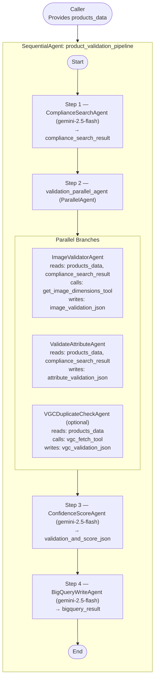

# Technical Design Document
## Product Validation Pipeline — POC Image Features

Version: 1.2  
Date: April 6, 2026  
Framework: Google Agent Development Kit (ADK)

---

## Table of Contents

1. Project Overview  
2. System Architecture  
3. Active Pipeline Execution Flow  
4. Agent Deep-Dive  
   - 4.1 Compliance Search Agent — ComplianceSearchAgent  
   - 4.2 Image Validator Agent — ImageValidatorAgent  
   - 4.3 Attribute Validation Agent — ValidateAttributeAgent  
   - 4.4 Confidence Score Agent — ConfidenceScoreAgent  
   - 4.5 BigQuery Write Agent — BigQueryWriteAgent  
   - 4.6 VGC Duplicate Check Agent — VGCDuplicateCheckAgent (optional)  
5. Tools Reference  
   - 5.1 get_image_dimensions_tool  
   - 5.2 bigquery_write_tool  
   - 5.3 vgc_fetch_tool (new)  
6. Session State Lifecycle and Data Contracts  
7. Data Model(s)  
8. External Services & Environment Configuration  
9. Python Dependencies  
10. Data Flow Diagram  
11. Change Log (what changed vs earlier draft)  
12. Known Gaps and Next Steps

---

## 1. Project Overview

This project implements a multi-agent product validation pipeline on Google’s ADK. The pipeline:
- Retrieves compliance rules via Vertex AI Search
- Validates product images (dimensions, visual content)
- Validates product attributes (textual/structural quality and policy adherence)
- Produces a per-product confidence score with an explicit decision (Approve/Reject)
- Writes the final score payload to BigQuery
- New: Optionally fetches historical product rows to surface VGC (Variant Group Code) duplicate signals for business insight

The pipeline is orchestrated by a root SequentialAgent with a single parallel step for running the core validations concurrently.

---

## 2. System Architecture

### Agent Hierarchy (as implemented)

```
product_validation_pipeline          (SequentialAgent — root)
├── ComplianceSearchAgent            (LlmAgent — Step 1)
├── validation_parallel_agent        (ParallelAgent — Step 2)
│   ├── ImageValidatorAgent          (LlmAgent — parallel branch A)
│   └── ValidateAttributeAgent       (LlmAgent — parallel branch B)
│   └── VGCDuplicateCheckAgent       (LlmAgent — optional, disabled by default)
├── ConfidenceScoreAgent             (LlmAgent — Step 3)
└── BigQueryWriteAgent               (LlmAgent — Step 4)
```

- File: root_agent/agent.py  
- By default, the VGC agent is present in code but commented out from `validation_parallel_agent.sub_agents`.  
- The parallel agent writes branch outputs to distinct session keys to avoid conflicts.

---

## 3. Active Pipeline Execution Flow

Inputs: Caller must provide `products_data` in session state (JSON list or a JSON string of a list).

Sequence:

1) ComplianceSearchAgent (Step 1)  
- Reads: none (uses Vertex AI Search directly)  
- Writes: `compliance_search_result`

2) validation_parallel_agent (Step 2)
- Branch A (ImageValidatorAgent)
  - Reads: `products_data`, `compliance_search_result`
  - Calls: `get_image_dimensions_tool` (FunctionTool)
  - Writes: `image_validation_json`
- Branch B (ValidateAttributeAgent)
  - Reads: `products_data`, `compliance_search_result`
  - Writes: `attribute_validation_json`
- Branch C (VGCDuplicateCheckAgent) — optional, disabled by default
  - Reads: `products_data`
  - Calls: `vgc_fetch_tool` (FunctionTool)
  - Writes: `vgc_validation_json`

3) ConfidenceScoreAgent (Step 3)  
- Reads: `image_validation_json`, `attribute_validation_json`  
- Adds: `session_id` (captured from the ADK session via `before_agent_callback`)  
- Writes: `validation_and_score_json`  
Note: VGC findings are not read by default into the scoring prompt. If you enable the VGC agent and want findings to affect scoring, update the prompt to include `vgc_validation_json`.

4) BigQueryWriteAgent (Step 4)  
- Reads: `validation_and_score_json`  
- Calls: `bigquery_write_tool` (FunctionTool)  
- Writes: `bigquery_result`

Ordering guarantees:
- Steps 1 → 2 → 3 → 4 run in sequence.
- Inside Step 2, branches run in parallel.

---

## 4. Agent Deep-Dive

### 4.1 Compliance Search Agent — ComplianceSearchAgent

- Type: LlmAgent  
- Model: gemini-2.5-flash  
- File: root_agent/sub_agents/compliance_search_agent.py  
- Output key: `compliance_search_result`  
- Tool(s): VertexAiSearchTool

Behavior:
- Queries the Vertex AI Search datastore for image, attribute, brand/vendor, PR/legal constraints and summarizes into JSON:
```
{
  "compliance_rules": [
    {
      "category": "<Image Issues | Category Validation | Variants | Vendor Agreements | Brand Consistency>",
      "rule_type": "<e.g., dimensions, background, variants>",
      "requirement": "<specific requirement>",
      "applies_to": "<all products | category-specific | Ready to Wear | Lifestyle>",
      "references": "<citations or snippets>"
    }
  ],
  "summary": "<brief summary>"
}
```

---

### 4.2 Image Validator Agent — ImageValidatorAgent

- Type: LlmAgent  
- Model: gemini-2.5-flash  
- File: root_agent/sub_agents/validate_image_agent.py  
- Output key: `image_validation_json`  
- Tool(s): `get_image_dimensions_tool`

Core behavior:
- Injects product image `Part.from_uri` from `products_data`.
- Prefers `data.main_image.source`, falls back to `original_url`, similar for alternates.
- Calls `get_image_dimensions_tool` per URL to obtain width/height/format.
- Performs visual compliance pass using `compliance_search_result`.

Output (shape excerpt):
```
{
  "results": [
    {
      "product_id": "...",
      "image_url": "...",
      "image_type": "main",
      "width": 1920,
      "height": 1080,
      "format": "JPEG",
      "compliant": true,
      "compliance_score": 92,
      "rule_results": [{"rule": "...", "passed": true, "observation": "..."}],
      "issues": [],
      "details": "..."
    }
  ],
  "compliance_rules_applied": ["..."]
}
```

---

### 4.3 Attribute Validation Agent — ValidateAttributeAgent

- Type: LlmAgent  
- Model: gemini-2.5-flash  
- File: root_agent/sub_agents/validate_attribute_agent.py  
- Output key: `attribute_validation_json`  
- Tool(s): none

Core behavior:
- Consumes `products_data` and `compliance_search_result`.
- Validates textual/structural attributes (PR/legal wording, required fields, brand consistency, variants logic, spelling).

Output (shape excerpt):
```
{
  "mirakl_product_id": "<id>",
  "product_sku": "<sku>",
  "invalid_attributes": [{"attribute": "<name>", "issue": "<description>"}],
  "rule_results": [{"rule": "...", "passed": true, "observation": "..."}],
  "category_validation": {"p1_p2_p3_correct": true, "issues": []},
  "variant_validation": {"unique_combinations": true, "issues": []},
  "brand_validation": {"consistent": true, "issues": []},
  "vendor_rejection": {"rejected": false, "reason": ""}
}
```

---

### 4.4 Confidence Score Agent — ConfidenceScoreAgent

- Type: LlmAgent  
- Model: gemini-2.5-flash  
- File: root_agent/sub_agents/confidence_score_agent.py  
- Output key: `validation_and_score_json`  
- Tool(s): none

Core behavior:
- Merges `attribute_validation_json` and `image_validation_json`.
- Holistically assigns a per-product `confidence_score` (0–100).
- Injects `session_id` from the ADK session into state.
- Strict enum constraints:
  - `validation_decision`: Approve | Reject
  - `status`: validated

Output (shape excerpt):
```
{
  "mirakl_product_id": "<id>",
  "status": "validated",
  "confidence_score": <0-100>,
  "validation_decision": "Approve" | "Reject",
  "ai_comment": "<reasoned explanation>",
  "session_id": "<uuid>"
}
```

Note: The default prompt does not yet read `vgc_validation_json`. You can extend it to do so when enabling VGC.

---

### 4.5 BigQuery Write Agent — BigQueryWriteAgent

- Type: LlmAgent  
- Model: gemini-2.5-flash  
- File: root_agent/sub_agents/bigquery_write_agent.py  
- Output key: `bigquery_result`  
- Tool(s): `bigquery_write_tool`

Instruction (summarized):
- Call `write_to_bigquery` with:
  - `confidence_score_json: {validation_and_score_json}`
- Return the tool’s response as-is.

---

### 4.6 VGC Duplicate Check Agent — VGCDuplicateCheckAgent (optional)

- Type: LlmAgent  
- Model: gemini-2.5-flash  
- File: root_agent/sub_agents/validate_vgc_agent.py  
- Output key: `vgc_validation_json`  
- Tool(s): `vgc_fetch_tool`

Core behavior:
- Extracts identity fields from `products_data` (variant_group_code/style_number, brand, title, size, colour, seller).
- Calls `vgc_fetch_tool` to obtain:
  - `cross_vgc_matches`: Same seller + brand + title but different VGC (potential duplicate across codes).
  - `intra_vgc_variants`: All existing variants within the same VGC (to detect size+colour duplicates and metadata inconsistencies).
- Returns findings only; does not decide Approve/Reject.

Output (shape excerpt):
```
{
  "mirakl_product_id": "<id>",
  "cross_vgc_check": {
    "matches_found": <number>,
    "matching_products": [{"mirakl_product_id": "...", "variant_group_code": "..."}],
    "observation": "..."
  },
  "intra_vgc_check": {
    "total_variants_in_group": <number>,
    "existing_combinations": [{"mirakl_product_id": "...", "size": "...", "colour": "..."}],
    "duplicate_found": <true|false>,
    "duplicate_products": [{"mirakl_product_id": "...", "size": "...", "colour": "..."}],
    "observation": "..."
  }
}
```

---

## 5. Tools Reference

### 5.1 get_image_dimensions_tool
- Type: FunctionTool
- File: root_agent/tools/tools.py
- Signature:
  - `get_image_dimensions(url: str) -> Dict[str, Any]`
- Behavior:
  - Downloads image via `requests.get`, loads via `PIL.Image`, returns `{ url, width, height, format }` or `{ url, error }`.

### 5.2 bigquery_write_tool
- Type: FunctionTool
- File: root_agent/tools/bigquery_tool.py
- Signature:
  - `write_to_bigquery(confidence_score_json: dict) -> dict[str, Any]`
- Environment:
  - `GOOGLE_CLOUD_PROJECT` (required)
  - `BQ_DATASET` (default recommended: product_validation)
  - `BQ_TABLE` (default recommended: validation_results)
- Behavior:
  - Validates input against `ConfidenceScoreRecord` (pydantic).
  - Inserts one normalized row into `{GOOGLE_CLOUD_PROJECT}.{BQ_DATASET}.{BQ_TABLE}` via `insert_rows_json`.
  - Returns success/error dict with details.
- Data fields:
  - Required: `mirakl_product_id`, `status`, `confidence_score`, `validation_decision`, `ai_comment`
  - Optional (but recommended for analytics): `variant_group_code`, `brand`, `title`, `description`, `size`, `colour`, `seller`, `session_id`

Note: The inline docstring previously implied all fields were required; implementation accepts optional fields (nullable in BQ schema).

### 5.3 vgc_fetch_tool (new)
- Type: FunctionTool
- File: root_agent/tools/bigquery_tool.py
- Signature:
  - `fetch_vgc_comparison_data(variant_group_code: str | None, brand: str | None, title: str | None, seller: str | None) -> dict[str, Any]`
- Behavior:
  - Query 1 (Cross-VGC): same seller + brand + title, different VGC.
  - Query 2 (Intra-VGC): all rows in the same VGC (for size/colour comparisons).
  - Returns `{ cross_vgc_matches: [...], intra_vgc_variants: [...], error?: str }`.

---

## 6. Session State Lifecycle and Data Contracts

Shared state keys and producers/consumers:

| Key                      | Written by                 | Read by                                  | Shape (summary) |
|--------------------------|----------------------------|-------------------------------------------|-----------------|
| products_data            | Caller (captured by root)  | ImageValidatorAgent, ValidateAttributeAgent, VGCDuplicateCheckAgent | JSON list (or JSON string) of normalized product objects |
| compliance_search_result | ComplianceSearchAgent      | ImageValidatorAgent, ValidateAttributeAgent | `{ "compliance_rules": [...], "summary": "..." }` |
| image_validation_json    | ImageValidatorAgent        | ConfidenceScoreAgent                      | See §4.2 output |
| attribute_validation_json| ValidateAttributeAgent     | ConfidenceScoreAgent                      | See §4.3 output |
| vgc_validation_json      | VGCDuplicateCheckAgent     | Optional (not read by default)            | See §4.6 output |
| validation_and_score_json| ConfidenceScoreAgent       | BigQueryWriteAgent                        | See §4.4 output |
| bigquery_result          | BigQueryWriteAgent         | Caller / downstream                       | From write tool |
| session_id               | ConfidenceScoreAgent       | BigQueryWriteAgent (via record)           | String captured per run |

Notes:
- VGC branch is optional/disabled by default; enable to populate `vgc_validation_json`.
- ConfidenceScoreAgent requires both Step 2 core outputs to exist before running.

---

## 7. Data Model(s)

### 7.1 ConfidenceScoreRecord (pydantic)
- File: root_agent/models.py
- Purpose: Typed row for BigQuery write with core decision plus optional identity/traceability fields.
- Fields:
  - Required: `mirakl_product_id`, `status`, `confidence_score`, `validation_decision`, `ai_comment`
  - Optional: `variant_group_code`, `brand`, `title`, `description`, `size`, `colour`, `seller`, `session_id`
- Method: `to_bq_row()` → flat dict suitable for `insert_rows_json`.

### 7.2 ValidationRecord (pydantic) — legacy/utility
- File: root_agent/models.py
- Not wired into the active pipeline; retained for potential future schemas.

---

## 8. External Services & Environment Configuration

### 8.1 GCP Services
- Vertex AI (Gemini 2.5 Flash): LLM for all LlmAgents
- Vertex AI Search: compliance rules datastore
- BigQuery: storage of validation score rows and VGC comparison fetches

### 8.2 Environment Variables
- `GOOGLE_CLOUD_PROJECT` (required by agents/tools using GCP services)
- `BQ_DATASET` (optional; default: `product_validation`)
- `BQ_TABLE` (optional; default: `validation_results`)
- ADC/Credentials: standard ADC setup for local or GCP-attached identity
- dotenv: agents load `.env` via python-dotenv

---

## 9. Python Dependencies

From requirements.txt:
- google-adk >= 0.3.0
- google-cloud-bigquery >= 3.25.0
- google-cloud-aiplatform >= 1.38.0
- google-genai >= 1.0.0
- google-cloud-storage >= 3.0.0
- pydantic >= 2.0.0
- python-dotenv >= 1.0.0
- pillow >= 10.0.0
- requests >= 2.31.0
- Development (optional): pytest, pytest-asyncio, ruff

---

## 10. Data Flow Diagram



---

## 11. Change Log (what changed vs earlier draft)

- Added optional VGC duplicate insights path:
  - New tool: `vgc_fetch_tool` (root_agent/tools/bigquery_tool.py)
  - New agent: `VGCDuplicateCheckAgent` (root_agent/sub_agents/validate_vgc_agent.py)
  - Wired as a potential third branch in the parallel step (disabled by default)
- Extended scoring traceability:
  - ConfidenceScoreAgent injects `session_id` into state and includes it in output JSON
- BigQuery write model:
  - `ConfidenceScoreRecord` now supports optional identity/traceability fields (variant_group_code, brand, title, description, size, colour, seller, session_id)
  - Clarified that only core decision fields are required; others are optional but recommended
- Documentation alignment:
  - Updated execution flow, agents, tools, session keys, and data model sections to reflect the above

---

## 12. Known Gaps and Next Steps

- VGC branch is present but disabled by default. To incorporate its findings into scoring:
  - Enable `validate_vgc_agent` in `validation_parallel_agent.sub_agents` in `root_agent/agent.py`
  - Update the ConfidenceScoreAgent prompt to read and reason over `vgc_validation_json`
- The `write_to_bigquery` docstring previously implied all fields were required; implementation accepts optional fields. Keep BQ schema nullable for optional columns.
- Rule coverage depends on your Vertex AI Search datastore curation; refine content for category depth and precision.
- Consider adding structured issue codes to standardize downstream analytics (e.g., IMAGE_BG_NON_WHITE, ATTR_MISSING_SIZE).
