# Technical Design Document  
## Product Validation Pipeline — POC Image Features

**Version:** 1.0  
**Date:** March 17, 2026  
**Framework:** Google Agent Development Kit (ADK)  

---

## Table of Contents

1. [Project Overview](#1-project-overview)
2. [System Architecture](#2-system-architecture)
3. [Active Pipeline Execution Flow](#3-active-pipeline-execution-flow)
4. [Agent Deep-Dive](#4-agent-deep-dive)
   - 4.1 [Root Agent — `product_validation_pipeline`](#41-root-agent--product_validation_pipeline)
   - 4.2 [Compliance Search Agent — `ComplianceSearchAgent`](#42-compliance-search-agent--compliancesearchagent)
   - 4.3 [Legal Agent — `LegalAgent`](#43-legal-agent--legalagent)
   - 4.4 [Validation Group — `ParallelAgent`](#44-validation-group--parallelagent)
   - 4.5 [Image Validator Agent — `ImageValidatorAgent`](#45-image-validator-agent--imagevalidatoragent)
   - 4.6 [Attribute Validation Agent — `AttributeValidationAgent`](#46-attribute-validation-agent--attributevalidationagent)
   - 4.7 [Legal Validation Agent — `LegalValidationAgent`](#47-legal-validation-agent--legalvalidationagent)
   - 4.8 [Score Agent — `ScoreAgent`](#48-score-agent--scoreagent)
5. [Tools Reference](#5-tools-reference)
6. [Compliance Rules](#6-compliance-rules)
7. [Data Flow Flowchart](#7-data-flow-flowchart)
8. [Session State Lifecycle](#8-session-state-lifecycle)
9. [External Services & Dependencies](#9-external-services--dependencies)

---

## 1. Project Overview

This project is a **multi-agent product validation pipeline** built on Google's Agent Development Kit (ADK). It is designed to ingest structured product data, validate product images against compliance rules, validate product attributes against schema requirements, and produce a machine-readable confidence score for each product.

The pipeline operates **sequentially** — each agent produces output that is stored in the ADK session state and consumed by the next agent downstream.

### Goals

| Goal | Mechanism |
|------|-----------|
| Centralise compliance rule retrieval | `ComplianceSearchAgent` (Step 1) — Vertex AI Search |
| Enrich compliance rules with live legal data | `LegalAgent` (Step 2) — fetches rules from web URLs, merges into `compliance_rules` |
| Validate product images (dimension, quality, content) | `ImageValidatorAgent` (Step 3 — parallel) + `get_image_dimensions_tool` + Gemini vision |
| Enforce attribute completeness per product type | `AttributeValidationAgent` (Step 3 — parallel) + Vertex AI Search |
| Validate products against legal requirements | `LegalValidationAgent` (Step 3 — parallel) Implement if needed |
| Score each product's reliability (0–100) | `ScoreAgent` (Step 4) — LLM reasoning over all validation results |
| Surface actionable issues per product | Structured JSON output at every stage |

---

## 2. System Architecture

### Agent Hierarchy

```
product_validation_pipeline           (SequentialAgent — root)
├── ComplianceSearchAgent             (LlmAgent — Step 1)
│   └── VertexAiSearchTool            (GCP Vertex AI Search)
├── LegalAgent                        (LlmAgent — Step 2)
│   └── url_context / web fetch tool  (fetches rules from web URLs)
├── validation_group                  (ParallelAgent — Step 3)
│   ├── ImageValidatorAgent           (LlmAgent — parallel branch A)
│   │   └── get_image_dimensions_tool (FunctionTool — Pillow/requests)
│   ├── AttributeValidationAgent      (LlmAgent — parallel branch B)
│   │   └── VertexAiSearchTool        (GCP Vertex AI Search)
│   └── LegalValidationAgent          (LlmAgent — parallel branch C)
└── ScoreAgent                        (LlmAgent — Step 4)
```

## 3. Active Pipeline Execution Flow

When a query is submitted to the `product_validation_pipeline`, the following sequence executes. Note: `products_data` (the list of products to validate) must already be present in the session state — either injected directly by the caller or pre-populated by an earlier step.

```
Caller submits query
       │
       ▼
[SequentialAgent] product_validation_pipeline
       │
       ├─── Step 1 ──► ComplianceSearchAgent
       │                    reads:  (none — queries Vertex AI Search directly)
       │                    writes: compliance_rules (session state)
       │
       ├─── Step 2 ──► LegalAgent
       │                    reads:  compliance_rules (session state)
       │                    writes: compliance_rules (session state, enriched with legal rules)
       │
       ├─── Step 3 ──► validation_group  [ParallelAgent]
       │                    ├── ImageValidatorAgent
       │                    │       reads:  products_data, compliance_rules
       │                    │       writes: image_validation_json
       │                    │
       │                    ├── AttributeValidationAgent
       │                    │       reads:  products_data, compliance_rules
       │                    │       writes: attribute_validation_json
       │                    │
       │                    └── LegalValidationAgent
       │                            reads:  products_data, compliance_rules
       │                            writes: legal_validation_json
       │
       └─── Step 4 ──► ScoreAgent
                            reads:  image_validation_json (session state)
                                    attribute_validation_json (session state)
                                    legal_validation_json (session state)
                            writes: validation_and_score_json (session state)
```

The `SequentialAgent` guarantees strict ordering across the four steps. Within Step 3, the `ParallelAgent` runs all three validation agents simultaneously — each writes to a distinct session state key, so there is no conflict.

---

## 4. Agent Deep-Dive

### 4.1 Root Agent — `product_validation_pipeline`

**Type:** `SequentialAgent`  
**File:** [root_agent/agent.py](../root_agent/agent.py)

The root agent is a pure orchestrator. It holds no LLM model of its own and executes no tool calls. Its only responsibility is to invoke its `sub_agents` list in declaration order, passing the shared session state between them.

**Behaviour when a query arrives:**

1. The user (or calling application) submits a natural-language query along with session state that contains `products_data`.
2. The `SequentialAgent` invokes `ComplianceSearchAgent` (Step 1), blocking until it writes `compliance_rules` to session state.
3. `LegalAgent` (Step 2) then runs — it reads the existing `compliance_rules`, fetches additional legal rules from web URLs, and writes the merged result back to `compliance_rules`.
4. The `ParallelAgent` (`validation_group`, Step 3) launches `ImageValidatorAgent`, `AttributeValidationAgent`, and `LegalValidationAgent` concurrently. All three read `compliance_rules` and write to their respective output keys.
5. Once all three parallel branches complete, `ScoreAgent` (Step 4) reads all three validation results and writes `validation_and_score_json`. The pipeline then terminates and the final session state is returned to the caller.

---

### 4.2 Compliance Search Agent — `ComplianceSearchAgent`

**Type:** `LlmAgent`  
**Model:** `gemini-2.5-flash`  
**File:** [sub_agents/compliance_search_agent.py](../sub_agents/compliance_search_agent.py)  
**Output key:** `compliance_rules`  
**Tools available:** `VertexAiSearchTool` (datastore: `poc-policy-datastore`)

#### Role in the pipeline

`ComplianceSearchAgent` is the **first step** in the `SequentialAgent`. It runs before any validation and its output (`compliance_rules`) is consumed by all downstream agents, giving the pipeline a single authoritative source of truth for compliance requirements.

#### Step-by-step execution

1. Issues two searches against the `poc-policy-datastore` Vertex AI Search datastore:
   - `"mandatory image requirements for product listings"`
   - `"image validation rules dimensions format background"`
2. Consolidates all retrieved rules, removing duplicates.
3. Writes structured JSON to the `compliance_rules` session state key:

```json
{
  "compliance_rules": [
    {
      "rule_type": "dimensions",
      "requirement": "Minimum 1920×1080 pixels",
      "applies_to": "all products"
    },
    {
      "rule_type": "background",
      "requirement": "White or neutral background required",
      "applies_to": "all products"
    }
  ],
  "summary": "All product images must be Full HD (1920×1080) minimum, sharp, and show the product as dominant."
}
```

---

### 4.3 Legal Agent — `LegalAgent`

#### Role in the pipeline

`LegalAgent` is the **second step** in the `SequentialAgent`. It runs immediately after `ComplianceSearchAgent` and enriches the shared `compliance_rules` state key by appending legal and regulatory rules fetched from authoritative web URLs. The merged result is written back to `compliance_rules` in the same JSON schema, giving all downstream validation agents a single, unified rules object that covers both internal policy and external legal requirements.

#### Step-by-step execution

1. Reads the current `compliance_rules` from session state (written by `ComplianceSearchAgent`).
2. Fetches legal requirement documents from the configured web URLs using the web fetch tool.
3. Extracts applicable rules from the fetched content and normalises them into the same `compliance_rules` JSON schema:

```json
{
  "rule_type": "legal",
  "requirement": "<extracted legal requirement>",
  "applies_to": "<all products | specific category>",
  "source_url": "<origin URL>"
}
```

4. Merges the newly extracted rules into the existing rules list, removing duplicates.
5. Writes the enriched object back to `compliance_rules` in session state:

```json
{
  "compliance_rules": [
    {
      "rule_type": "dimensions",
      "requirement": "Minimum 1920×1080 pixels",
      "applies_to": "all products"
    },
    {
      "rule_type": "legal",
      "requirement": "Product must comply with applicable consumer safety regulations",
      "applies_to": "all products",
      "source_url": "https://..."
    }
  ],
  "summary": "Consolidated compliance and legal rules for product validation."
}
```

---

### 4.4 Validation Group — `ParallelAgent`

**Type:** `ParallelAgent`  
**File:** [root_agent/agent.py](../root_agent/agent.py)  
**Sub-agents:** `ImageValidatorAgent`, `AttributeValidationAgent`, `LegalValidationAgent(If Needed)`

#### Role in the pipeline

The `validation_group` is the **third step** in the root `SequentialAgent`. It wraps all three validation agents in an ADK `ParallelAgent`, meaning they are dispatched concurrently and run simultaneously. Each agent reads from shared session state (which is safe because they only read `products_data` and `compliance_rules`, not write to each other's keys) and writes to its own distinct output key. The `ParallelAgent` completes only when all three branches have finished.

| Branch | Agent | Output key |
|--------|-------|------------|
| A | `ImageValidatorAgent` | `image_validation_json` |
| B | `AttributeValidationAgent` | `attribute_validation_json` |
| C | `LegalValidationAgent` | `legal_validation_json` |

---

### 4.5 Image Validator Agent — `ImageValidatorAgent`

**Type:** `LlmAgent`  
**Model:** `gemini-2.5-flash`  
**File:** [sub_agents/validate_image_agent.py](../sub_agents/validate_image_agent.py)  
**Output key:** `image_validation_json`  
**Tools available:** `get_image_dimensions_tool`

#### What it does

This agent validates all product images in `products_data` against the compliance rules already present in session state as `compliance_rules`. It checks both quantitative metrics (pixel dimensions) and qualitative visual attributes using Gemini's native vision capability — product images are injected directly into the Gemini request as inline `Part.from_uri` parts via a `before_model_callback`.

#### Step-by-step execution

**Step 1 — Image injection (before_model_callback)**

Before the LLM request is sent, the `_inject_product_images` callback reads every product in `products_data` from session state and injects their image URLs (main + all alternate images) as `Part.from_uri` parts directly into the Gemini request. Each image part is preceded by a descriptive text label:

```
[Product ID: abc-123 | image_type: main | url: https://...]
```

This means the agent can **see** the actual images rather than relying on an external analysis tool.

**Step 2 — Read compliance rules (from session state)**

The agent reads `{compliance_rules}` directly from the session state — no additional tool call is needed. By the time `ImageValidatorAgent` runs, `compliance_rules` has been written by `ComplianceSearchAgent` and further enriched by `LegalAgent`.

**Step 3 — Dimension check**

For every image URL visible in the conversation, the agent calls `get_image_dimensions_tool` with that URL.  
- The tool downloads the image using `requests` and opens it with `Pillow`.  
- Returns: `{ url, width, height, format }` or an error dict if the download fails.

**Step 4 — Visual compliance check**

Using the injected image parts, the agent visually inspects each image against every compliance rule from Step 2 — assessing background colour, product centring, clutter, watermarks, sharpness, and any other visual rules directly from the image content.

**Step 5 — Result assembly**

Combines the pixel dimension result (Step 3) and the visual inspection (Step 4) against the compliance rules. Derives a per-image `compliant: true/false` flag and a `compliance_score`.

**Output written to session state (`image_validation_json`):**

```json
{
  "results": [
    {
      "product_id": "abc-123",
      "image_url": "https://...",
      "image_type": "main",
      "width": 2048,
      "height": 1536,
      "format": "JPEG",
      "compliant": true,
      "compliance_score": 92,
      "rule_results": [
        { "rule": "min_resolution_1920x1080", "passed": true, "observation": "2048×1536 exceeds minimum" },
        { "rule": "white_background", "passed": true, "observation": "Clean white background observed" }
      ],
      "issues": [],
      "details": "Image passes all compliance checks."
    }
  ],
  "summary": {
    "total": 1,
    "compliant": 1,
    "non_compliant": 0
  },
  "compliance_rules_applied": ["min_resolution_1920x1080", "white_background", "product_dominant"]
}
```

---

### 4.6 Attribute Validation Agent — `AttributeValidationAgent`

**Type:** `LlmAgent`  
**Model:** `gemini-2.5-flash`  
**File:** [sub_agents/validate_attribute_agent.py](../sub_agents/validate_attribute_agent.py)  
**Output key:** `attribute_validation_json`  
**Tools available:** `VertexAiSearchTool` (direct, same datastore as `ComplianceSearchAgent`)

#### What it does

This agent runs as **parallel branch B** inside the `validation_group`. It validates product attribute completeness and quality against the compliance rules stored in Vertex AI Search. It focuses exclusively on attribute data — scoring is handled separately by `ScoreAgent`.

#### Step-by-step execution

**Step 1 — Retrieve attribute compliance rules**

Issues targeted searches against the `poc-policy-datastore`:

- Search 1: `"common required attributes"` — retrieves universal required fields (`brand`, `title`, `product_category`, `main_image`).
- Search 2: `"required attributes for product type <product_type>"` — retrieves type-specific required fields.

**Step 2 — Per-product attribute check**

For each product in `products_data`, evaluates:
- Are all required common attributes present and non-empty?
- Are all type-specific required attributes present and non-empty?
- Are there null values or empty strings in required fields?

**Output written to session state (`attribute_validation_json`):**

```json
{
  "results": [
    {
      "mirakl_product_id": "abc-123",
      "product_sku": "4135850671899",
      "product_type": "5_8_1_99999_125_1035",
      "common_attributes_valid": true,
      "type_specific_attributes_valid": false,
      "missing_attributes": ["care", "choking_hazard"],
      "empty_attributes": [],
      "issues": [
        "Missing required attribute: 'care'",
        "Missing required attribute: 'choking_hazard'"
      ]
    }
  ],
  "summary": {
    "total_products": 1,
    "fully_valid": 0,
    "has_issues": 1
  }
}
```

---

### 4.5 Score Agent — `ScoreAgent`

**Type:** `LlmAgent`  
**Model:** `gemini-2.5-flash`  
**File:** [sub_agents/confidence_score_agent.py](../sub_agents/confidence_score_agent.py)  
**Output key:** `validation_and_score_json`  
**Tools available:** none

#### What it does

`ScoreAgent` is the **final step** in the pipeline. It reads `image_validation_json` and `attribute_validation_json` from session state and combines them into a **per-product confidence score (0–100)** with a **confidence level** (High / Good / Medium / Low) and itemised `ai_comments`.

#### Step-by-step execution

**Step 1 — Read prior validation results**

Reads directly from session state:
- `image_validation_json` — per-image compliance results from `ImageValidatorAgent`
- `attribute_validation_json` — per-product attribute results from `AttributeValidationAgent`

**Step 2 — Multi-factor scoring**

For each product, evaluates three dimensions:

| Dimension | What is checked |
|-----------|-----------------|
| **Image compliance** | Did `image_validation_json` mark this product's images as `compliant: true`? What is the `compliance_score`? |
| **Attribute completeness** | Did `attribute_validation_json` find any missing or empty required attributes? |
| **Data quality** | Are there null values, empty strings, or structural issues in the product data? |

**Step 3 — Score assignment**

The LLM assigns:

- A **numeric confidence score** (0–100)
- A **confidence level** derived from the score:
  - **High:** 80–100 — All attributes present, image compliant, no legal violations, no issues
  - **Good:** 60–79 — Minor issues (1–2 non-critical missing attributes or minor image issues)
  - **Medium:** 40–59 — Several missing attributes, image non-compliant, or minor legal issues
  - **Low:** 0–39 — Critical failures (missing mandatory attributes, image failed, or legal violations)
- `ai_comments`: Point-by-point explanation of every issue found across all validation dimensions

**Output written to session state (`validation_and_score_json`):**

```json
{
  "results": [
    {
      "mirakl_product_id": "abc-123",
      "product_sku": "4135850671899",
      "confidence_score": 72,
      "ai_comments": "1. Missing attribute: 'care' (required for product type 5_8_1_99999_125_1035). 2. Missing attribute: 'choking_hazard'. 3. Image validated as compliant (2048×1536, white background, product dominant). 4. Common attributes (brand, title, product_category, main_image) all present. 5. No legal compliance violations found."
    }
  ],
  "summary": {
    "total_products": 1,
    "high_confidence": 0,
    "good_confidence": 1,
    "medium_confidence": 0,
    "low_confidence": 0,
    "average_score": 72
  }
}
```

---

## 5. Tools Reference

### `get_image_dimensions_tool`

| Property | Value |
|----------|-------|
| Type | `FunctionTool` (wraps `get_image_dimensions`) |
| File | [tools/tools.py](../tools/tools.py) |
| Input | `url: str` |
| Output | `{ url, width, height, format }` or `{ url, error }` |
| Library | `requests`, `Pillow` |
| Timeout | 10 seconds |

Downloads the image at the given URL using `requests.get` and opens it with `PIL.Image.open(BytesIO(...))`. Extracts pixel width, height, and format string. Returns an error dict if the download or image read fails.

---

## 6. Compliance Rules

Stored in: [docs/product_validation_compliance.txt](product_validation_compliance.txt)  
Indexed in: Vertex AI Search datastore `poc-policy-datastore`

> **Note — Current approach is not the final implementation.**  
> Compliance rules are currently maintained as a static text file that is manually indexed into the Vertex AI Search datastore. In the future, this will be replaced by a **Google Drive connector** (or an equivalent managed connector) that automatically syncs source documents from Google Drive directly into the datastore, eliminating the need for manual uploads and keeping the indexed rules up to date without any pipeline changes.

### Image Requirements (applies to all products)

| Rule | Requirement |
|------|-------------|
| Minimum resolution | 1920×1080 pixels (Full HD) |
| Image sharpness | Must not be blurred |
| Dominant object | Product must be the dominant object in the frame |
| Content match | Product title and description must match image content |
| Image URL | Must be present and downloadable |

### Required Attributes

**Common (all product types):**  
`brand`, `title`, `product_category`, `main_image`

**Type `5_8_1_99999_125_1035`** (+ common):  
`care`, `origin`, `feature_1`, `feature_2`, `color_family`, `style_number`, `display_color`, `choking_hazard`, `fabric_material`, `meta_description`, `style_description`, `perishable_indicator`, `nrf_size-5_8_1_99999_125_1035`

**Type `3_14_63`** (+ common):  
`care`, `origin`, `prop_65`, `Priority`, `feature_1`, `feature_2`, `feature_3`, `is_ltl_item`, `color_family`, `containsPFAS`, `room-3_14_63`, `style_number`, `display_color`, `choking_hazard`, `fabric_material`, `meta_description`, `nrf_size-3_14_63`, `style_description`, `perishable_indicator`, `recommended_usage-3_14_63`

**Type `33_106_1479`** (+ common):  
`care`, `origin`, `feature_1`, `feature_2`, `color_family`, `style_number`, `display_color`, `choking_hazard`, `fabric_material`, `meta_description`, `style_description`, `nrf_size-33_106_1479`, `perishable_indicator`, `recommended_usage-33_106_1479`

---

## 7. Data Flow Flowchart

```mermaid
flowchart TD
    A([**Caller**\nSubmits query\nwith products_data in session state]) --> B

    subgraph ROOT["🔗 SequentialAgent: product_validation_pipeline"]
        direction TB

        subgraph STEP1["Step 1 — ComplianceSearchAgent (gemini-2.5-flash)"]
            direction TB
            B[Search 1: mandatory image requirements\nVertexAiSearchTool → poc-policy-datastore]
            B --> B2[Search 2: image validation rules\ndimensions format background]
            B2 --> B3[Consolidate & deduplicate rules]
            B3 --> B4([Write compliance_rules\nto session state])
        end

        subgraph STEP2["Step 2 — LegalAgent (gemini-2.5-flash)"]
            direction TB
            LA1[Read compliance_rules\nfrom session state]
            LA1 --> LA2[Fetch legal requirement documents\nfrom configured web URLs]
            LA2 --> LA3[Extract & normalise rules\ninto compliance_rules schema]
            LA3 --> LA4[Merge with existing rules\nremove duplicates]
            LA4 --> LA5([Write enriched compliance_rules\nback to session state])
        end

        subgraph STEP3["Step 3 — validation_group (ParallelAgent)"]
            direction LR

            subgraph BRANCH_A["Branch A — ImageValidatorAgent"]
                direction TB
                C[before_model_callback:\nInject product image URLs\nas Part.from_uri]
                C --> D[Read compliance_rules]
                D --> E[Call get_image_dimensions_tool]
                E --> F[Visually inspect images\nvs. compliance rules]
                F --> G{Compliant?}
                G -->|Yes| I1[compliant: true]
                G -->|No| I2[compliant: false + issues]
                I1 --> J([Write image_validation_json])
                I2 --> J
            end

            subgraph BRANCH_B["Branch B — AttributeValidationAgent"]
                direction TB
                K[Read compliance_rules]
                K --> L[Search: common required attributes\nVertexAiSearchTool]
                L --> M[Search: type-specific attributes\nVertexAiSearchTool]
                M --> N[Check attributes\npresent & non-empty]
                N --> P([Write attribute_validation_json])
            end

            subgraph BRANCH_C["Branch C — LegalValidationAgent(Implement if Needed)"]
                direction TB
                LV1[Read compliance_rules\nfilter legal rules]
                LV1 --> LV2[For each product:\ncheck against legal rules]
                LV2 --> LV3([Write legal_validation_json])
            end
        end

        subgraph STEP4["Step 4 — ScoreAgent (gemini-2.5-flash)"]
            direction TB
            Q[Read image_validation_json]
            Q --> R[Read attribute_validation_json]
            R --> R2[Read legal_validation_json]
            R2 --> S[Score each product across\n4 dimensions:\nImage · Attributes · Legal · Data quality]
            S --> T[Assign confidence_score 0–100\nHigh · Good · Medium · Low]
            T --> U([Write validation_and_score_json\nto session state])
        end

        B4 --> LA1
        LA5 --> C
        LA5 --> K
        LA5 --> LV1
        J --> Q
        P --> Q
        LV3 --> Q
    end

    U --> Z([**Final Session State**\ncontains compliance_rules\n+ image_validation_json\n+ attribute_validation_json\n+ legal_validation_json\n+ validation_and_score_json])

    style ROOT fill:#f0f4ff,stroke:#4a6fa5,stroke-width:2px
    style STEP1 fill:#fdf0ff,stroke:#8844cc,stroke-width:1.5px
    style STEP2 fill:#fff0e8,stroke:#b85c00,stroke-width:1.5px
    style STEP3 fill:#f0fff0,stroke:#228822,stroke-width:1.5px
    style BRANCH_A fill:#e8f4e8,stroke:#2d7a2d,stroke-width:1px
    style BRANCH_B fill:#fff4e8,stroke:#c47a00,stroke-width:1px
    style BRANCH_C fill:#ffeef0,stroke:#cc2244,stroke-width:1px
    style STEP4 fill:#e8f0ff,stroke:#2060c0,stroke-width:1.5px
```



---

## 8. Session State Lifecycle

The ADK session state is the **shared memory bus** between all agents. The following keys are written and consumed throughout the pipeline:

| Key | Written by | Read by | Contents |
|-----|-----------|---------|----------|
| `products_data` | Caller / pre-populated | `ImageValidatorAgent`, `AttributeValidationAgent`, `LegalValidationAgent`, `ScoreAgent` | JSON array of normalized product records |
| `compliance_rules` | `ComplianceSearchAgent` (initial), `LegalAgent` (enriched) | `ImageValidatorAgent`, `AttributeValidationAgent`, `LegalValidationAgent` | Consolidated compliance + legal rules; `LegalAgent` appends legal entries to the list written by `ComplianceSearchAgent` |
| `image_validation_json` | `ImageValidatorAgent` | `ScoreAgent` | Per-product image compliance results + per-rule observations + summary |
| `attribute_validation_json` | `AttributeValidationAgent` | `ScoreAgent` | Per-product attribute validation results + missing/empty attribute list |
| `legal_validation_json` | `LegalValidationAgent` | `ScoreAgent` | Per-product legal compliance results + violation list |
| `validation_and_score_json` | `ScoreAgent` | Caller / downstream | Confidence scores + ai_comments per product |

**Ordering guarantees:**  
- Steps 1 → 2 → 3 → 4 are sequentially ordered by the root `SequentialAgent`.  
- Within Step 3, the `ParallelAgent` runs all three branches simultaneously. Each branch writes to its own distinct key, so there is no write conflict.  
- `ScoreAgent` (Step 4) only starts after the `ParallelAgent` has reported all three branches complete — guaranteeing `image_validation_json`, `attribute_validation_json`, and `legal_validation_json` all exist before scoring begins.

---

## 9. External Services & Dependencies

### GCP Services

| Service | Usage |
|---------|-------|
| **Vertex AI (Gemini 2.5 Flash)** | LLM powering all six `LlmAgent` instances |
| **Vertex AI Search** | Datastore `poc-policy-datastore` indexing compliance rules |

### Python Dependencies

| Library | Version | Purpose |
|---------|---------|---------|
| `google-adk` | ≥ 0.3.0 | Agent framework (`SequentialAgent`, `ParallelAgent`, `LlmAgent`, `FunctionTool`) |
| `google-cloud-bigquery` | ≥ 3.25.0 | BigQuery client for result storage |
| `google-cloud-aiplatform` | ≥ 1.38.0 | Vertex AI Search integration |
| `pydantic` | ≥ 2.0.0 | `ValidationRecord` data model |
| `python-dotenv` | ≥ 1.0.0 | Loading `GOOGLE_CLOUD_PROJECT` and BQ env vars |
| `pillow` | ≥ 10.0.0 | Image dimension extraction in `get_image_dimensions` |
| `requests` | ≥ 2.31.0 | HTTP client for image download and Mirakl API |
