# Technical Design Document  
## Product Validation Pipeline — POC Image Features

**Version:** 1.0  
**Date:** March 11, 2026  
**Framework:** Google Agent Development Kit (ADK)  

---

## Table of Contents

1. [Project Overview](#1-project-overview)
2. [System Architecture](#2-system-architecture)
3. [Active Pipeline Execution Flow](#3-active-pipeline-execution-flow)
4. [Agent Deep-Dive](#4-agent-deep-dive)
   - 4.1 [Root Agent — `product_validation_pipeline`](#41-root-agent--product_validation_pipeline)
   - 4.2 [Image Validator Agent — `ImageValidatorAgent`](#42-image-validator-agent--imagevalidatoragent)
   - 4.3 [Compliance Search Agent — `ComplianceSearchAgent`](#43-compliance-search-agent--compliancesearchagent)
   - 4.4 [URL Context Agent — `UrlContextAgent`](#44-url-context-agent--urlcontextagent)
   - 4.5 [Validate and Score Agent — `ValidateAndScoreAgent`](#45-validate-and-score-agent--validateandscoreeagent)
5. [Tools Reference](#5-tools-reference)
6. [Data Models](#6-data-models)
7. [Compliance Rules](#7-compliance-rules)
8. [Data Flow Flowchart](#8-data-flow-flowchart)
9. [Session State Lifecycle](#9-session-state-lifecycle)
10. [External Services & Dependencies](#10-external-services--dependencies)

---

## 1. Project Overview

This project is a **multi-agent product validation pipeline** built on Google's Agent Development Kit (ADK). It is designed to ingest structured product data, validate product images against compliance rules, validate product attributes against schema requirements, and produce a machine-readable confidence score for each product.

The pipeline operates **sequentially** — each agent produces output that is stored in the ADK session state and consumed by the next agent downstream.

### Goals

| Goal | Mechanism |
|------|-----------|
| Validate product images (dimension, quality, content) | `ImageValidatorAgent` + tools |
| Enforce attribute completeness per product type | `ValidateAndScoreAgent` + Vertex AI Search |
| Score each product's reliability (0–100) | LLM reasoning in `ValidateAndScoreAgent` |
| Surface actionable issues per product | Structured JSON output at every stage |

---

## 2. System Architecture

### Agent Hierarchy

```
product_validation_pipeline   (SequentialAgent — root)
├── ImageValidatorAgent        (LlmAgent — Step 1)
│   ├── ComplianceSearchAgent  (LlmAgent — wrapped as AgentTool)
│   │   └── VertexAiSearchTool (GCP Vertex AI Search)
│   ├── get_image_dimensions_tool (FunctionTool — Pillow/requests)
│   └── UrlContextAgent        (LlmAgent — wrapped as AgentTool)
│       └── url_context        (Built-in ADK tool)
└── ValidateAndScoreAgent      (LlmAgent — Step 2)
    └── VertexAiSearchTool     (GCP Vertex AI Search — direct)
```

### Component Map

| Component | Type | File | Responsibility |
|-----------|------|------|----------------|
| `product_validation_pipeline` | `SequentialAgent` | `root_agent/root_agent.py` | Orchestrates all sub-agents in order |
| `ImageValidatorAgent` | `LlmAgent` | `sub_agents/validate_image_agent.py` | Validates product images |
| `ComplianceSearchAgent` | `LlmAgent` | `sub_agents/compliance_search_agent.py` | Retrieves image compliance rules |
| `UrlContextAgent` | `LlmAgent` | `sub_agents/url_context_agent.py` | Visual image analysis from URL |
| `ValidateAndScoreAgent` | `LlmAgent` | `sub_agents/validate_attribute_agent.py` | Attribute validation + confidence scoring |
| `get_image_dimensions_tool` | `FunctionTool` | `tools/tools.py` | Downloads image; returns pixel dimensions |
| `fetch_products_tool` | `FunctionTool` | `tools/tools.py` | Fetches products from Mirakl API |
| `bigquery_write_tool` | `FunctionTool` | `tools/bigquery_tool.py` | Writes results to BigQuery |
| `ValidationRecord` | Pydantic model | `models.py` | Flattens data into BigQuery row format |

---

## 3. Active Pipeline Execution Flow

When a query is submitted to the `product_validation_pipeline`, the following sequence executes. Note: `products_data` (the list of products to validate) must already be present in the session state — either injected directly by the caller or pre-populated by an earlier step.

```
Caller submits query
       │
       ▼
[SequentialAgent] product_validation_pipeline
       │
       ├─── Step 1 ──► ImageValidatorAgent
       │                    reads:  products_data (session state)
       │                    writes: image_validation_json (session state)
       │
       └─── Step 2 ──► ValidateAndScoreAgent
                            reads:  products_data (session state)
                                    image_validation_json (session state)
                            writes: validation_and_score_json (session state)
```

The `SequentialAgent` guarantees that Step 2 never starts before Step 1 has completed and written its output key to session state.

---

## 4. Agent Deep-Dive

### 4.1 Root Agent — `product_validation_pipeline`

**Type:** `SequentialAgent`  
**File:** [root_agent/root_agent.py](../root_agent/root_agent.py)

The root agent is a pure orchestrator. It holds no LLM model of its own and executes no tool calls. Its only responsibility is to invoke its `sub_agents` list in declaration order, passing the shared session state between them.

**Behaviour when a query arrives:**

1. The user (or calling application) submits a natural-language query along with session state that contains `products_data`.
2. The `SequentialAgent` invokes `ImageValidatorAgent`, blocking until it completes.
3. Once `ImageValidatorAgent` writes `image_validation_json` to session state, the `SequentialAgent` invokes `ValidateAndScoreAgent`.
4. After `ValidateAndScoreAgent` writes `validation_and_score_json`, the pipeline terminates and the final session state is returned to the caller.

---

### 4.2 Image Validator Agent — `ImageValidatorAgent`

**Type:** `LlmAgent`  
**Model:** `gemini-2.5-flash`  
**File:** [sub_agents/validate_image_agent.py](../sub_agents/validate_image_agent.py)  
**Output key:** `image_validation_json`  
**Tools available:** `compliance_search_tool`, `get_image_dimensions_tool`, `url_context_tool`

#### What it does

This agent validates all product images in `products_data` against the compliance rules stored in Vertex AI Search. It checks both quantitative metrics (pixel dimensions) and qualitative visual attributes (background, product placement, blur).

#### Step-by-step execution

**Step 1 — Retrieve compliance rules**

The agent calls `compliance_search_tool` (which is `ComplianceSearchAgent` wrapped as an `AgentTool`) with the query:

> *"Retrieve the mandatory image requirements for product listings."*

`ComplianceSearchAgent` searches the Vertex AI Search datastore (`poc-policy-datastore`) and returns a structured JSON listing all image compliance rules, e.g.:
- Minimum resolution: 1920×1080 pixels
- Product must be the dominant object
- Background must be appropriate
- Image must not be blurred
- Product title and description must match the image contents

**Step 2 — Per-product image processing**

For each product in `products_data`, the agent:

a. **Extracts the image URL** from the product's `images` array.

b. **Calls `get_image_dimensions_tool`** with the URL.  
   - This tool uses the Python `requests` library to download the image and `Pillow` to open it.
   - Returns: `{ url, width, height, format }` or an error object if the download fails.
   - Example result: `{ "url": "https://...", "width": 2048, "height": 1536, "format": "JPEG" }`

c. **Calls `url_context_tool`** (which is `UrlContextAgent` wrapped as an `AgentTool`) with the URL and a compliance-derived query built from the rules retrieved in Step 1.  
   - Example query: *"Does this image have a white/neutral background? Is the product the dominant object? Is the image sharp and not blurred?"*
   - `UrlContextAgent` uses the built-in ADK `url_context` tool to fetch and visually analyze the image, then returns a structured JSON of its findings.

**Step 3 — Compliance verification and result assembly**

For each product, the agent combines the pixel dimension result (Step 2b) and the visual analysis result (Step 2c) and compares them against the compliance rules (Step 1). It derives a `compliant: true/false` determination for each product.

**Output written to session state (`image_validation_json`):**

```json
{
  "results": [
    {
      "product_id": "abc-123",
      "image_url": "https://...",
      "width": 2048,
      "height": 1536,
      "format": "JPEG",
      "compliant": true,
      "details": "Image passes dimension check (2048×1536 ≥ 1920×1080). Background is white. Product is dominant.",
      "message": "PASS"
    }
  ],
  "summary": {
    "total": 1,
    "compliant": 1,
    "non_compliant": 0
  },
  "compliance_rules_applied": ["min_resolution_1920x1080", "white_background", "product_dominant"]
}
```

---

### 4.3 Compliance Search Agent — `ComplianceSearchAgent`

**Type:** `LlmAgent`  
**Model:** `gemini-2.5-flash`  
**File:** [sub_agents/compliance_search_agent.py](../sub_agents/compliance_search_agent.py)  
**Output key:** `compliance_search_result`  
**Tools available:** `VertexAiSearchTool` (datastore: `poc-policy-datastore`)

#### Role in the pipeline

This agent is **not a direct sub-agent of the root pipeline**. It is invoked as an `AgentTool` by `ImageValidatorAgent`. It is a specialised search assistant whose sole job is to look up compliance rules for the exact query it receives.

#### Step-by-step execution

1. Receives a focused query from `ImageValidatorAgent` (e.g., *"mandatory image requirements for product listings"*).
2. Calls `VertexAiSearchTool` with that query against the `poc-policy-datastore` Vertex AI Search datastore.
3. Filters results to return only rules directly relevant to the query — discarding unrelated compliance topics.
4. Returns structured JSON:

```json
{
  "query": "mandatory image requirements for product listings",
  "compliance_rules": [
    {
      "rule_type": "image_resolution",
      "requirement": "Minimum 1920×1080 pixels",
      "applies_to": "all products"
    },
    {
      "rule_type": "image_quality",
      "requirement": "Image must not be blurred",
      "applies_to": "all products"
    }
  ],
  "summary": "All product images must be Full HD (1920×1080) minimum, sharp, and show the product as dominant."
}
```

**Maximum remote tool calls:** 10 (configured via `AutomaticFunctionCallingConfig`)

---

### 4.4 URL Context Agent — `UrlContextAgent`

**Type:** `LlmAgent`  
**Model:** `gemini-2.5-flash`  
**File:** [sub_agents/url_context_agent.py](../sub_agents/url_context_agent.py)  
**Output key:** `url_context_result`  
**Tools available:** `url_context` (built-in ADK tool)

#### Role in the pipeline

Also invoked as an `AgentTool` by `ImageValidatorAgent`. It performs visual/qualitative analysis of a product image — answering specific questions that pixel-dimension checks cannot answer (e.g., *"Is the background neutral? Is the product centred?"*).

#### Step-by-step execution

1. Receives an image URL and a specific query from `ImageValidatorAgent`.
2. Uses the built-in ADK `url_context` tool to load the image from the URL.
3. Answers only what the query asks — does not produce unsolicited analysis.
4. Returns structured JSON:

```json
{
  "url": "https://example.com/product.jpg",
  "query": "Does this image have a white background? Is the product the dominant object?",
  "findings": {
    "white_background": true,
    "product_dominant": true,
    "sharp": true
  },
  "summary": "Image has a white background, product is centred and dominant, no blurring detected."
}
```

**Important constraint:** This agent reports only what it can directly observe. It does not hallucinate pixel values — those come exclusively from `get_image_dimensions_tool`.

---

### 4.5 Validate and Score Agent — `ValidateAndScoreAgent`

**Type:** `LlmAgent`  
**Model:** `gemini-2.5-flash`  
**File:** [sub_agents/validate_attribute_agent.py](../sub_agents/validate_attribute_agent.py)  
**Output key:** `validation_and_score_json`  
**Tools available:** `VertexAiSearchTool` (direct, same datastore)

#### What it does

This agent combines three information sources — compliance rules (from Vertex AI Search), image validation results (from session state), and product attribute data — to produce a **per-product confidence score from 0–100** and a **confidence level** (High / Good / Medium / Low), along with itemised issues.

#### Step-by-step execution

**Step 1 — Retrieve attribute compliance rules**

The agent issues targeted searches against the Vertex AI Search datastore:

- Search 1: `"common required attributes"` — retrieves the universal required fields (`brand`, `title`, `product_category`, `main_image`).
- Search 2: `"required attributes for product type <product_type>"` — retrieves the type-specific required fields (e.g., `care`, `origin`, `fabric_material`, `color_family`, etc. for type `5_8_1_99999_125_1035`).
- Search 3: `"image validation requirements"` — retrieves image compliance rules for cross-referencing.

**Maximum remote calls:** 15 (configured via `AutomaticFunctionCallingConfig`)

**Step 2 — Multi-factor scoring for each product**

For each product, the agent evaluates three dimensions:

| Dimension | What is checked |
|-----------|-----------------|
| **Compliance rules** | Are required common and type-specific attributes present and non-empty? |
| **Image validation** | Did `image_validation_json` mark this product's image as `compliant: true`? |
| **Data quality** | Are there missing fields, null values, or empty strings in required attributes? |

**Step 3 — Score assignment**

Based on the combined assessment, the LLM assigns:

- A **numeric confidence score** (0–100)
- A **confidence level** derived from the score:
  - **High:** 80–100 — All attributes present, image compliant, no issues
  - **Good:** 60–79 — Minor issues (1–2 non-critical missing attributes)
  - **Medium:** 40–59 — Several missing attributes or image non-compliant
  - **Low:** 0–39 — Critical failures (missing mandatory attributes, image failed)
- `ai_comments`: A detailed, point-by-point explanation of every issue found

**Output written to session state (`validation_and_score_json`):**

```json
{
  "results": [
    {
      "mirakl_product_id": "abc-123",
      "product_sku": "4135850671899",
      "confidence_score": 72,
      "ai_comments": "1. Missing attribute: 'care' (required for product type 5_8_1_99999_125_1035). 2. Missing attribute: 'choking_hazard'. 3. Image validated as compliant (2048×1536, white background, product dominant). 4. Common attributes (brand, title, product_category, main_image) all present."
    }
  ],
  "summary": {
    "total_products": 1,
    "high_confidence": 0,
    "good_confidence": 1,
    "medium_confidence": 0,
    "low_confidence": 0,
    "average_score": 72
  }
}
```

---

## 5. Tools Reference

### `get_image_dimensions_tool`

| Property | Value |
|----------|-------|
| Type | `FunctionTool` (wraps `get_image_dimensions`) |
| File | [tools/tools.py](../tools/tools.py) |
| Input | `url: str` |
| Output | `{ url, width, height, format }` or `{ url, error }` |
| Library | `requests`, `Pillow` |
| Timeout | 10 seconds |

Downloads the image at the given URL using `requests.get` and opens it with `PIL.Image.open(BytesIO(...))`. Extracts pixel width, height, and format string. Returns an error dict if the download or image read fails.

---

### `fetch_products_tool`

| Property | Value |
|----------|-------|
| Type | `FunctionTool` (wraps `fetch_products_from_mirakl`) |
| File | [tools/tools.py](../tools/tools.py) |
| Input | `updated_since`, `updated_to`, `product_sku` (all optional strings) |
| Output | `List[Dict]` — normalized product records |
| Endpoint | `https://kohlsus-dev.mirakl.net/api/mcm/products/export` |
| Auth | Bearer token in `Authorization` header |
| Timeout | 30 seconds |

Fetches products from the Mirakl API and normalizes each product into the standard pipeline shape:

```json
{
  "id": "<mirakl_product_id>",
  "product_type": "<product_category>",
  "product_sku": "<sku>",
  "product_attributes": { "brand": "...", "title": "...", ... },
  "images": [{ "url": "<main_image_url>" }]
}
```

---

### `bigquery_write_tool`

| Property | Value |
|----------|-------|
| Type | `FunctionTool` (wraps `write_to_bigquery`) |
| File | [tools/bigquery_tool.py](../tools/bigquery_tool.py) |
| Input | `product_details`, `image_validation`, `attribute_validation` (all dicts) |
| Output | `{ status, message }` |
| Destination | `{PROJECT}.{BQ_DATASET}.{BQ_TABLE}` (env-configured) |

Uses `ValidationRecord` (Pydantic model) to flatten nested product, image, and attribute data into a single BigQuery row and calls `client.insert_rows_json`. **Currently not active in the pipeline.**

---

## 6. Data Models

### `ValidationRecord` (Pydantic)

**File:** [models.py](../models.py)

| Field | Type | Description |
|-------|------|-------------|
| `product_details` | `dict` | Original product data from API |
| `image_validation` | `dict` | Image dimension validation results |
| `attribute_validation` | `dict` | Product attribute validation results |

The `to_bq_row()` method flattens all three nested structures into a single flat dict suitable for BigQuery insertion. Key flattened fields:

| BQ Column | Source |
|-----------|--------|
| `product_id` | `product_details.id` |
| `product_type` | `product_details.product_type` |
| `validation_status` | `"PASS"` if both image and attribute are valid, else `"FAIL"` |
| `validation_timestamp` | `datetime.utcnow().isoformat()` |
| `image_valid` | `image_validation.valid` |
| `image_width` / `image_height` | `image_validation.width/height` |
| `attribute_valid` | `attribute_validation.valid` |
| `missing_attributes` | JSON-serialized list |
| `empty_attributes` | JSON-serialized list |

---

## 7. Compliance Rules

Stored in: [docs/product_validation_compliance.txt](product_validation_compliance.txt)  
Indexed in: Vertex AI Search datastore `poc-policy-datastore`

### Image Requirements (applies to all products)

| Rule | Requirement |
|------|-------------|
| Minimum resolution | 1920×1080 pixels (Full HD) |
| Image sharpness | Must not be blurred |
| Dominant object | Product must be the dominant object in the frame |
| Content match | Product title and description must match image content |
| Image URL | Must be present and downloadable |

### Required Attributes

**Common (all product types):**  
`brand`, `title`, `product_category`, `main_image`

**Type `5_8_1_99999_125_1035`** (+ common):  
`care`, `origin`, `feature_1`, `feature_2`, `color_family`, `style_number`, `display_color`, `choking_hazard`, `fabric_material`, `meta_description`, `style_description`, `perishable_indicator`, `nrf_size-5_8_1_99999_125_1035`

**Type `3_14_63`** (+ common):  
`care`, `origin`, `prop_65`, `Priority`, `feature_1`, `feature_2`, `feature_3`, `is_ltl_item`, `color_family`, `containsPFAS`, `room-3_14_63`, `style_number`, `display_color`, `choking_hazard`, `fabric_material`, `meta_description`, `nrf_size-3_14_63`, `style_description`, `perishable_indicator`, `recommended_usage-3_14_63`

**Type `33_106_1479`** (+ common):  
`care`, `origin`, `feature_1`, `feature_2`, `color_family`, `style_number`, `display_color`, `choking_hazard`, `fabric_material`, `meta_description`, `style_description`, `nrf_size-33_106_1479`, `perishable_indicator`, `recommended_usage-33_106_1479`

---

## 8. Data Flow Flowchart

```mermaid
flowchart TD
    A([**Caller**\nSubmits query\nwith products_data in session state]) --> B

    subgraph ROOT["🔗 SequentialAgent: product_validation_pipeline"]
        direction TB

        subgraph STEP1["Step 1 — ImageValidatorAgent (gemini-2.5-flash)"]
            direction TB
            B[Read products_data\nfrom session state]
            B --> C[Call ComplianceSearchAgent\nQuery: mandatory image requirements]

            subgraph CSA["ComplianceSearchAgent (AgentTool)"]
                C1[VertexAiSearchTool\n→ poc-policy-datastore]
                C2[Filter & return\ncompliance rules JSON]
                C1 --> C2
            end
            C --> C1
            C2 --> D

            D[For each product:\nExtract image URL]
            D --> E[Call get_image_dimensions_tool\n→ Download with requests\n→ Open with Pillow\n→ Return width, height, format]
            E --> F[Call UrlContextAgent\nQuery: visual compliance questions]

            subgraph UCA["UrlContextAgent (AgentTool)"]
                U1[url_context tool\n→ Fetch image from URL]
                U2[LLM answers visual\ncompliance questions]
                U1 --> U2
            end
            F --> U1
            U2 --> G

            G[Combine dimensions + visual analysis\nvs. compliance rules]
            G --> H{Compliant?}
            H -->|Yes| I1[compliant: true]
            H -->|No| I2[compliant: false\n+ reason]
            I1 --> J
            I2 --> J
            J([Write image_validation_json\nto session state])
        end

        subgraph STEP2["Step 2 — ValidateAndScoreAgent (gemini-2.5-flash)"]
            direction TB
            K[Read products_data\nfrom session state]
            K --> L[Read image_validation_json\nfrom session state]
            L --> M[Search 1: common required attributes\nVertexAiSearchTool]
            M --> N[Search 2: required attributes\nfor product_type\nVertexAiSearchTool]
            N --> O[Search 3: image validation requirements\nVertexAiSearchTool]
            O --> P[For each product:\nCheck common attributes present & non-empty]
            P --> Q[Check type-specific\nattributes present & non-empty]
            Q --> R[Cross-reference image_validation_json\nfor this product]
            R --> S[LLM scores all three dimensions\nand assigns confidence score 0–100]
            S --> T([Write validation_and_score_json\nto session state])
        end

        J --> K
    end

    T --> Z([**Final Session State**\ncontains image_validation_json\n+ validation_and_score_json])

    style ROOT fill:#f0f4ff,stroke:#4a6fa5,stroke-width:2px
    style STEP1 fill:#e8f4e8,stroke:#2d7a2d,stroke-width:1.5px
    style STEP2 fill:#fff4e8,stroke:#c47a00,stroke-width:1.5px
    style CSA fill:#e0f0ff,stroke:#2060c0,stroke-width:1px
    style UCA fill:#e0f0ff,stroke:#2060c0,stroke-width:1px
```



---

## 9. Session State Lifecycle

The ADK session state is the **shared memory bus** between all agents. The following keys are written and consumed throughout the pipeline:

| Key | Written by | Read by | Contents |
|-----|-----------|---------|----------|
| `products_data` | Caller / pre-populated | `ImageValidatorAgent`, `ValidateAndScoreAgent` | JSON array of normalized product records |
| `image_validation_json` | `ImageValidatorAgent` | `ValidateAndScoreAgent` | Per-product image compliance results + summary |
| `compliance_search_result` | `ComplianceSearchAgent` | `ImageValidatorAgent` (via AgentTool return) | Compliance rules from Vertex AI Search |
| `url_context_result` | `UrlContextAgent` | `ImageValidatorAgent` (via AgentTool return) | Visual analysis findings for a single image |
| `validation_and_score_json` | `ValidateAndScoreAgent` | Caller / downstream | Confidence scores + ai_comments per product |

**Sequential guarantee:** Because the root agent is a `SequentialAgent`, `image_validation_json` is guaranteed to exist in session state before `ValidateAndScoreAgent` starts. There is no race condition.

---

## 10. External Services & Dependencies

### GCP Services

| Service | Usage |
|---------|-------|
| **Vertex AI (Gemini 2.5 Flash)** | LLM powering all four `LlmAgent` instances |
| **Vertex AI Search** | Datastore `poc-policy-datastore` indexing compliance rules |
| **BigQuery** | Target storage for validation results (inactive in current pipeline) |

### Python Dependencies

| Library | Version | Purpose |
|---------|---------|---------|
| `google-adk` | ≥ 0.3.0 | Agent framework (`SequentialAgent`, `LlmAgent`, `FunctionTool`, `AgentTool`) |
| `google-cloud-bigquery` | ≥ 3.25.0 | BigQuery client for result storage |
| `google-cloud-aiplatform` | ≥ 1.38.0 | Vertex AI Search integration |
| `pydantic` | ≥ 2.0.0 | `ValidationRecord` data model |
| `python-dotenv` | ≥ 1.0.0 | Loading `GOOGLE_CLOUD_PROJECT` and BQ env vars |
| `pillow` | ≥ 10.0.0 | Image dimension extraction in `get_image_dimensions` |
| `requests` | ≥ 2.31.0 | HTTP client for image download and Mirakl API |

### Environment Variables

| Variable | Required | Description |
|----------|----------|-------------|
| `GOOGLE_CLOUD_PROJECT` | Yes | GCP project ID used for Vertex AI and BigQuery |
| `BQ_DATASET` | No (default: `product_validation`) | BigQuery dataset name |
| `BQ_TABLE` | No (default: `validation_results`) | BigQuery table name |

---

*End of Technical Design Document*
