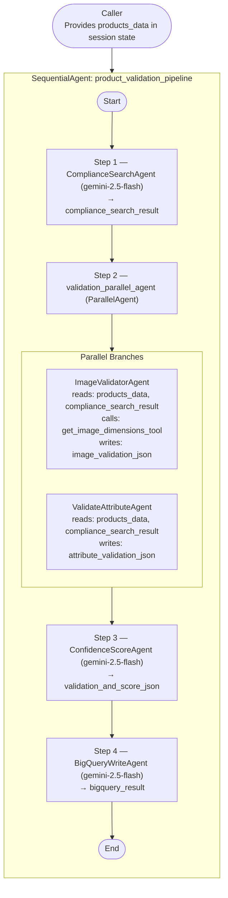

# Technical Design Document
## Product Validation Pipeline — POC Image Features

Version: 1.1  
Date: March 26, 2026  
Framework: Google Agent Development Kit (ADK)

---

## Table of Contents

1. Project Overview  
2. System Architecture  
3. Active Pipeline Execution Flow  
4. Agent Deep-Dive  
   - 4.1 Compliance Search Agent — ComplianceSearchAgent  
   - 4.2 Image Validator Agent — ImageValidatorAgent  
   - 4.3 Attribute Validation Agent — ValidateAttributeAgent  
   - 4.4 Confidence Score Agent — ConfidenceScoreAgent  
   - 4.5 BigQuery Write Agent — BigQueryWriteAgent  
5. Tools Reference  
6. Session State Lifecycle and Data Contracts  
7. Data Model(s)  
8. External Services & Environment Configuration  
9. Python Dependencies  
10. Data Flow Diagram  
11. Change Log (what changed vs earlier draft)  
12. Known Gaps and Next Steps

---

## 1. Project Overview

This project implements a multi-agent product validation pipeline on Google’s Agent Development Kit (ADK). The pipeline:
- Retrieves compliance rules via Vertex AI Search
- Validates product images (dimensions, visual content)
- Validates product attributes (textual/structural quality and policy adherence)
- Produces a per-product confidence score with an explicit decision (Approve/Reject)
- Writes the final score payload to BigQuery

The pipeline is orchestrated by a root SequentialAgent with a single parallel step for running image and attribute validation concurrently.

---

## 2. System Architecture

### Agent Hierarchy (as implemented)

```
product_validation_pipeline          (SequentialAgent — root)
├── ComplianceSearchAgent            (LlmAgent — Step 1)
├── validation_parallel_agent        (ParallelAgent — Step 2)
│   ├── ImageValidatorAgent          (LlmAgent — parallel branch A)
│   └── ValidateAttributeAgent       (LlmAgent — parallel branch B)
├── ConfidenceScoreAgent             (LlmAgent — Step 3)
└── BigQueryWriteAgent               (LlmAgent — Step 4)
```

- File: root_agent/agent.py  
- The parallel agent runs image and attribute validation concurrently and writes their outputs to distinct session keys to avoid conflicts.

---

## 3. Active Pipeline Execution Flow

Inputs: Caller must provide `products_data` in session state (JSON list or a JSON string of a list).

Sequence:

1) ComplianceSearchAgent (Step 1)
- Reads: none (uses Vertex AI Search directly)
- Writes: compliance_search_result

2) validation_parallel_agent (Step 2)
- Branch A (ImageValidatorAgent)
  - Reads: products_data, compliance_search_result
  - Calls: get_image_dimensions_tool (FunctionTool)
  - Writes: image_validation_json
- Branch B (ValidateAttributeAgent)
  - Reads: products_data, compliance_search_result
  - Writes: attribute_validation_json

3) ConfidenceScoreAgent (Step 3)
- Reads: image_validation_json, attribute_validation_json
- Writes: validation_and_score_json

4) BigQueryWriteAgent (Step 4)
- Reads: validation_and_score_json
- Calls: bigquery_write_tool (FunctionTool)
- Writes: bigquery_result

Ordering guarantees:
- Steps 1 → 2 → 3 → 4 run in sequence.
- Inside Step 2, image and attribute validation run in parallel.

---

## 4. Agent Deep-Dive

### 4.1 Compliance Search Agent — ComplianceSearchAgent

- Type: LlmAgent  
- Model: gemini-2.5-flash  
- File: root_agent/sub_agents/compliance_search_agent.py  
- Output key: compliance_search_result  
- Tool(s): VertexAiSearchTool

Configuration:
- Loads environment variables with python-dotenv.
- PROJECT_ID from env var GOOGLE_CLOUD_PROJECT.
- DATASTORE_ID is built as a fully qualified Vertex AI Search datastore:
  projects/{GOOGLE_CLOUD_PROJECT}/locations/us/collections/default_collection/dataStores/validation-documents-stg_1774252852913_gcs_store

Behavior:
- Issues a set of domain-specific search queries (image rules, attribute rules, brand/vendor/PR/legal constraints, etc.) and consolidates results.
- Returns ONLY JSON with the following shape (example):

```
{
  "compliance_rules": [
    {
      "category": "<Image Issues | Category Validation | Variants | Vendor Agreements | Brand Consistency>",
      "rule_type": "<e.g., dimensions, background, variants>",
      "requirement": "<specific requirement>",
      "applies_to": "<all products | category-specific | Ready to Wear | Lifestyle>",
      "references": "<citations or snippets>"
    }
  ],
  "summary": "<brief summary>"
}
```

Notes:
- Agent must avoid over-generalizing category-specific rules.

---

### 4.2 Image Validator Agent — ImageValidatorAgent

- Type: LlmAgent  
- Model: gemini-2.5-flash  
- File: root_agent/sub_agents/validate_image_agent.py  
- Output key: image_validation_json  
- Tool(s): get_image_dimensions_tool (FunctionTool)

Core behavior:
- before_model_callback (_inject_product_images) reads `products_data` from session state and injects image URLs as inline `Part.from_uri` into the Gemini request.
- Always prefers `data.main_image.source` (falls back to `original_url`), similarly for `data.alt_image_*`.
- Calls `get_image_dimensions_tool` for each URL to obtain width/height/format.
- Performs a visual compliance pass using the injected images against `compliance_search_result`.

Output:
```
{
  "results": [
    {
      "product_id": "...",
      "image_url": "...",
      "image_type": "main",
      "width": 1920,
      "height": 1080,
      "format": "JPEG",
      "compliant": true,
      "compliance_score": 92,
      "rule_results": [
        {"rule": "...", "passed": true, "observation": "..."}
      ],
      "issues": [],
      "details": "..."
    }
  ],
  "compliance_rules_applied": ["..."]
}
```

---

### 4.3 Attribute Validation Agent — ValidateAttributeAgent

- Type: LlmAgent  
- Model: gemini-2.5-flash  
- File: root_agent/sub_agents/validate_attribute_agent.py  
- Output key: attribute_validation_json  
- Tool(s): none (relies on `compliance_search_result`)

Core behavior:
- Consumes `products_data` and `compliance_search_result`.
- Validates textual and structural attributes (PR/legal wording constraints, required fields, brand consistency in text, variants logic, spelling correctness in customer-facing text).
- Does not perform image analysis (that’s ImageValidatorAgent’s scope).

Output:
```
{
  "mirakl_product_id": "<id>",
  "product_sku": "<sku>",
  "invalid_attributes": [
    {"attribute": "<name>", "issue": "<description>"}
  ],
  "rule_results": [
    {"rule": "...", "passed": true, "observation": "..."}
  ],
  "category_validation": {"p1_p2_p3_correct": true, "issues": []},
  "variant_validation": {"unique_combinations": true, "issues": []},
  "brand_validation": {"consistent": true, "issues": []},
  "vendor_rejection": {"rejected": false, "reason": ""}
}
```

---

### 4.4 Confidence Score Agent — ConfidenceScoreAgent

- Type: LlmAgent  
- Model: gemini-2.5-flash  
- File: root_agent/sub_agents/confidence_score_agent.py  
- Output key: validation_and_score_json  
- Tool(s): none

Core behavior:
- Merges `attribute_validation_json` and `image_validation_json`.
- Holistically assigns a per-product `confidence_score` (0–100).
- Strict enum constraints (must match exactly):
  - `validation_decision`: Approve | Reject
  - `status`: validated

Output:
```
{
  "mirakl_product_id": "<id>",
  "status": "validated",
  "confidence_score": <0-100>,
  "validation_decision": "Approve" | "Reject",
  "ai_comment": "<reasoned explanation>"
}
```

---

### 4.5 BigQuery Write Agent — BigQueryWriteAgent

- Type: LlmAgent  
- Model: gemini-2.5-flash  
- File: root_agent/sub_agents/bigquery_write_agent.py  
- Output key: bigquery_result  
- Tool(s): bigquery_write_tool (FunctionTool)

Instruction (summarized):
- Call `write_to_bigquery` with:
  - `confidence_score_json: {validation_and_score_json}`
- Return the tool’s response as-is.

---

## 5. Tools Reference

### 5.1 get_image_dimensions_tool
- Type: FunctionTool (wraps Python function)
- File: root_agent/tools/tools.py
- Function signature:
  - `get_image_dimensions(url: str) -> Dict[str, Any]`
- Behavior:
  - `requests.get(url, timeout=10)` → `PIL.Image.open(BytesIO(...))`
  - Returns:
    - On success: `{ url, width, height, format }`
    - On failure: `{ url, error }`

### 5.2 bigquery_write_tool
- Type: FunctionTool (wraps Python function)
- File: root_agent/tools/bigquery_tool.py
- Function signature:
  - `write_to_bigquery(confidence_score_json: dict[str, Any] | None) -> dict[str, Any]`
- Environment:
  - `GOOGLE_CLOUD_PROJECT` (required)
  - `BQ_DATASET` (default: product_validation)
  - `BQ_TABLE` (default: validation_results)
- Behavior:
  - Accepts the exact `validation_and_score_json` object from the scoring agent (or a wrapper that contains it).
  - Validates input is a dict and that `mirakl_product_id` exists.
  - Builds one row:
    ```
    {
      "mirakl_product_id": ...,
      "status": ...,
      "confidence_score": ...,
      "validation_decision": ...,
      "ai_comment": ...
    }
    ```
  - Uses a singleton `bigquery.Client(project=GOOGLE_CLOUD_PROJECT)`.
  - Fully qualified table id: `{GOOGLE_CLOUD_PROJECT}.{BQ_DATASET}.{BQ_TABLE}`.
  - Inserts with `client.insert_rows_json(table_id, rows)`.
  - Returns:
    - On success (empty error list): `{ "status": "success", "message": "...", "table": "<fqid>", "rows_inserted": 1 }`
    - On error: `{ "status": "error", "message": "BigQuery insert failed: <errors>" }`
    - On exception: `{ "status": "error", "message": "Failed to write to BigQuery: <exc>" }`

### 5.3 VertexAiSearchTool (used within agents)
- Provided by google-adk (`google.adk.tools.VertexAiSearchTool`)
- Consumed by ComplianceSearchAgent with a concrete `data_store_id` (see §4.1).
- Not exported as a project FunctionTool; it is directly instantiated by the agent.

---

## 6. Session State Lifecycle and Data Contracts

Shared state keys and producers/consumers:

| Key                      | Written by                 | Read by                                  | Shape (summary) |
|--------------------------|----------------------------|-------------------------------------------|-----------------|
| products_data            | Caller                     | ImageValidatorAgent, ValidateAttributeAgent | JSON list (or JSON string) of normalized product objects expected by agents |
| compliance_search_result | ComplianceSearchAgent      | ImageValidatorAgent, ValidateAttributeAgent | `{ "compliance_rules": [...], "summary": "..." }` |
| image_validation_json    | ImageValidatorAgent        | ConfidenceScoreAgent                      | See §4.2 output |
| attribute_validation_json| ValidateAttributeAgent     | ConfidenceScoreAgent                      | See §4.3 output |
| validation_and_score_json| ConfidenceScoreAgent       | BigQueryWriteAgent                        | See §4.4 output (enum constraints) |
| bigquery_result          | BigQueryWriteAgent         | Caller / downstream                        | From bigquery_write_tool result |

Notes:
- Parallel step in Step 2 writes independent keys to avoid conflicts.
- ConfidenceScoreAgent requires both Step 2 outputs to exist before running.

---

## 7. Data Model(s)

### 7.1 ValidationRecord (pydantic)
- File: root_agent/models.py
- Purpose: Utility model to flatten combined validation results into a BigQuery row (general-purpose).
- Current usage: Not wired into the active pipeline; retained for potential future integration or alternate BQ schemas.

Key method:
- `to_bq_row()` builds a flattened dictionary with identifiers, product attributes, image/attribute validation flags and messages, and dynamic attribute spreading.

---

## 8. External Services & Environment Configuration

### 8.1 GCP Services
- Vertex AI (Gemini 2.5 Flash): LLM for all LlmAgents
- Vertex AI Search: compliance rules datastore
- BigQuery: storage of validation score rows

### 8.2 Environment Variables
- `GOOGLE_CLOUD_PROJECT` (required by agents/tools using GCP services)
- `BQ_DATASET` (optional; default: `product_validation`)
- `BQ_TABLE` (optional; default: `validation_results`)
- ADC/Credentials: Standard Google Application Default Credentials apply (e.g., `GOOGLE_APPLICATION_CREDENTIALS` pointing to a service account JSON if not running on GCP with attached identity)

### 8.3 dotenv
- Agents load environment from `.env` via `python-dotenv`.

---

## 9. Python Dependencies

From requirements.txt:

- google-adk >= 0.3.0
- google-cloud-bigquery >= 3.25.0
- google-cloud-aiplatform >= 1.38.0
- pydantic >= 2.0.0
- python-dotenv >= 1.0.0
- pillow >= 10.0.0
- requests >= 2.31.0
- Development (optional): pytest, pytest-asyncio, ruff
- google-genai >= 1.0.0
- google-cloud-storage >= 3.0.0

---

## 10. Data Flow Diagram



---

## 11. Change Log (what changed vs earlier draft)

- Replaced prior “LegalAgent” and “LegalValidationAgent” references with the actual implemented pipeline (no legal-specific agents currently in code).
- Updated session state keys to match code:
  - compliance_search_result (replaces earlier `compliance_rules`)
  - Removed `legal_validation_json`
  - Added `bigquery_result`
- Added BigQuery write path:
  - New tool: `bigquery_write_tool` (root_agent/tools/bigquery_tool.py)
  - New agent: `BigQueryWriteAgent` (root_agent/sub_agents/bigquery_write_agent.py)
  - Documented env vars: GOOGLE_CLOUD_PROJECT, BQ_DATASET, BQ_TABLE
  - Documented return contract and error handling
- Documented `before_model_callback` image injection (Part.from_uri) for ImageValidatorAgent.
- Captured strict enum constraints enforced in ConfidenceScoreAgent (`validation_decision`, `status`).
- Clarified current usage of VertexAiSearchTool only within ComplianceSearchAgent.
- Noted presence of `ValidationRecord` model as optional utility (not wired).

---


